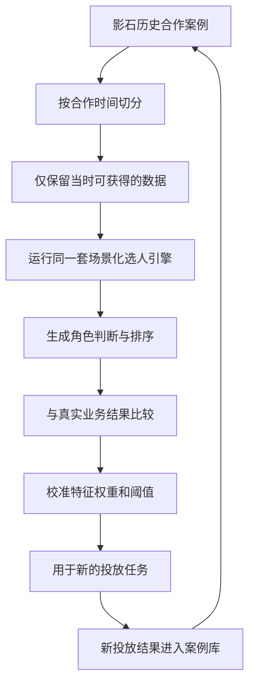
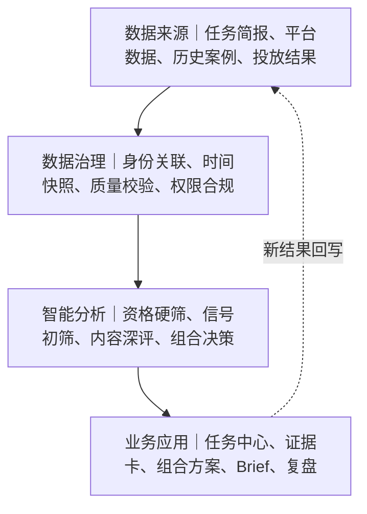

# 1. 业务问题与方案目标

影石Insta360的产品价值高度依赖真实使用场景。骑行、滑雪、潜水、摩托、旅行记录等内容，决定用户能否理解产品、形成兴趣并产生购买。达人因此承担了产品价值翻译和场景教育的双重作用，选人质量会直接影响内容表现、投放效率和新品进入市场的速度。

现有工作通常从平台搜索、达人库或人工经验出发，再依据粉丝量、互动率和过往合作记录形成名单。这套方式可以完成基础筛选，但面对跨平台、跨场景的大规模候选池时，判断标准容易分散在个人经验、表格和沟通记录中。视频到底在表达什么场景、评论里有没有真实需求、内容能否带动模仿、过往合作结果是否兑现，往往没有进入同一套决策过程。

## 1.1 核心问题

| 业务现象 | 直接影响 | 方案需要解决的判断 |
|-|-|-|
| 候选达人数量大、分布在多个平台 | 人工覆盖有限，容易集中在已经走红的账号 | 如何以可控成本发现并分层筛选候选人 |
| 通用指标无法完整描述内容质量 | 粉丝量相近的达人，实际场景表达和转化能力差异很大 | 如何理解视频场景、受众需求与内容扩散潜力 |
| 推荐理由缺少证据 | BD难以复核，也难向团队解释预算选择 | 如何让每项判断回到具体视频、评论和数据字段 |
| 历史合作结果没有系统沉淀 | 每轮选人都接近重新开始，经验难以复用 | 如何让历史案例参与当前判断，并在投后继续积累 |
| 投放过程存在大促、折扣和多渠道干扰 | 投后销量变化难以直接归到某位达人 | 如何区分转化追踪、相关归因与增量效果 |

## 1.2 方案目标与范围

本方案建设一套场景化达人投放决策系统。业务人员提交产品、目标市场、核心场景、预算和营销目标后，系统在可接入的数据范围内生成候选池，完成市场与合规硬筛、场景化内容评估和达人角色判断，最终给出带证据的达人投资组合、预算区间及本地化合作Brief。投放结果进入历史合作库，用于后续规则校准和案例复用。

方案覆盖达人发现、推荐、组合决策、内容协同与投后复盘。联系达人、商务谈判、合同签署、拍摄执行和付款仍由现有团队及流程负责，系统保留状态接口，区分“已推荐未投放”“已投放低效”等不同情况，避免把执行环节的问题误判为选人失误。

# 2. 总体方案

系统以一份结构化任务简报作为起点。任务简报包含产品及卖点、目标市场、核心场景、营销目标、预算范围、投放周期和品牌安全要求。市场、语言、合规和可合作状态用于确定候选边界；场景表达、受众需求、内容扩散潜力和历史效果用于候选排序；预算、角色互补和风险集中度用于形成最终组合。

## 2.1 三层决策逻辑

| 决策层 | 主要问题 | 处理方式 | 结果 |
|-|-|-|-|
| 资格层 | 这位达人能否进入本次任务 | 市场、语言、平台、受众地域、品牌安全、合规与合作状态硬筛 | 合格候选池 |
| 匹配层 | 这位达人适合承担什么任务 | 结合产品卖点和目标场景，分析视频内容、受众互动、成长势能与历史表现 | 角色判断、任务适配分和证据卡 |
| 组合层 | 有限预算如何覆盖目标并分散风险 | 在预算区间、场景覆盖、角色配比和达人集中度约束下构建方案 | 稳健型与进取型达人组合 |

这三层逻辑解决了“筛选条件”和“核心判断”混在一起的问题。北美市场等信息决定候选范围，产品场景决定合格候选之间的排序，营销目标和预算决定最终选择哪些人、各自承担什么角色。

## 2.2 达人投资组合

系统输出以达人组合为单位，保留个人排名作为内部参考。组合中的达人承担不同任务：引爆型负责获得初始关注，扩散型依靠容易模仿和分享的内容推动场景传播，转化型依靠精准受众和较强需求承接销售，潜力型用于探索尚未充分定价的成长达人。具体角色数量随产品、市场、目标和预算变化，不采用固定配比。

| 交付物 | 包含内容 | 使用者 |
|-|-|-|
| 任务分析页 | 目标拆解、候选边界、场景定义、风险约束 | 市场负责人、BD |
| 达人组合方案 | 角色配置、预算区间、场景覆盖、备选达人 | 市场负责人、预算审批人 |
| 推荐证据卡 | 视频片段、评论样本、关键指标、数据来源与置信度 | BD、内容团队 |
| 本地化合作Brief | 创作方向、产品卖点、场景建议、平台规范和禁用表达 | BD、达人、内容审核 |
| 投后复盘页 | 内容表现、直接转化、已知干扰因素和角色兑现情况 | 市场、数据与管理团队 |

# 3. 业务主链

业务主链沿着一次真实投放任务展开。每个环节都产生明确输出，并成为下一环节的输入。系统保留人工确认节点，重要推荐、预算选择和内容Brief均由业务人员复核后进入执行。

## 3.1 全链路输入、处理与输出

| 环节 | 输入 | 核心处理 | 输出 |
|-|-|-|-|
| 任务简报 | 产品、市场、场景、目标、预算、周期 | 识别硬约束、核心卖点和优先结果 | 结构化任务配置 |
| 候选发现 | 平台数据、第三方工具、现有达人库 | 跨来源召回、账号合并、数据去重 | 原始候选池 |
| 资格硬筛 | 市场、语言、品牌安全、合规要求 | 排除地域不符、风险过高和无法合作的账号 | 合格候选池 |
| 低成本初筛 | 账号指标、内容标签、增长趋势 | 以轻量规则和文本信号缩小分析范围 | 深评名单 |
| 场景深度评估 | 代表视频、画面与语音、评论、受众特征 | 识别场景表达、产品承载能力、内容复刻性和需求信号 | 任务适配特征 |
| 角色判断 | 任务适配特征、历史相似案例 | 判断引爆、扩散、转化或潜力探索角色，生成可追溯理由 | 角色标签、评分和证据卡 |
| 组合决策 | 候选角色、预算区间、场景覆盖与风险约束 | 形成角色互补、预算可控的组合及备选方案 | 达人投资组合 |
| 内容协同 | 达人风格、产品知识、地区文化和平台规范 | 生成并审核创作方向、合作要求和禁用表达 | 本地化合作Brief |
| 投放复盘 | 内容表现、链接与优惠码转化、同期营销事件 | 区分直接追踪结果、相关表现与可估计的增量效果 | 角色兑现结果和校准建议 |

工程上采用逐级收窄的分析漏斗。大规模候选只运行低成本筛选，视频多模态与评论语义分析集中在少量深评对象，控制接口调用、计算成本和交付时间。筛选过程中保留被排除原因，便于业务人员复查，也方便后续分析规则是否过严。

# 4. 核心能力设计

## 4.1 候选发现与分层分析

候选来源包括平台官方接口、合规采购的第三方达人数据、影石现有达人库和业务人员补充名单。系统先完成账号去重和跨平台身份关联，再执行市场、语言、受众地域、品牌安全和合作状态筛选。随后根据内容类别、增长趋势、互动质量等轻量信号进行初筛，将高成本的视频多模态和评论语义分析集中在少量候选上。

漏斗各层均记录进入条件、排除原因和数据新鲜度。业务人员可以查看某位达人在哪一层被排除，也可以调整任务约束后重新计算，避免黑箱式淘汰。

## 4.2 场景化匹配

场景是匹配层的核心变量。系统先把产品卖点转换为可观察的内容需求，例如第一视角稳定性、夜景运动画面、免手持记录、多人旅行叙事或水下成像，再分析候选达人过去内容中是否持续出现相应场景、是否具备自然承载产品的创作方式，以及受众是否在评论中表达相关需求。

| 判断维度 | 主要证据 | 业务含义 |
|-|-|-|
| 场景持续性 | 代表视频中的场景占比、连续发布周期 | 达人是否真正长期处于目标场景 |
| 产品承载能力 | 机位、叙事结构、产品露出方式、拍摄技术 | 产品进入内容后是否自然且能被理解 |
| 内容复刻性 | 动作门槛、拍摄成本、模板稳定性、用户模仿反馈 | 内容是否容易形成二次创作和场景扩散 |
| 需求强度 | 评论中的设备询问、购买讨论、使用问题与负面顾虑 | 受众是否具备真实需求和决策意图 |
| 增长势能 | 多周期内容增长、互动结构变化、爆款依赖程度 | 达人是否处于稳定成长阶段 |
| 合作与风险 | 历史品牌合作、内容争议、受众真实性、合作状态 | 商业可执行性和潜在风险 |

不同任务采用不同权重。北美摩托场景可能更重视高速运动画面、安装方式和装备讨论，亲子旅行场景则更重视叙事亲和力、便携性表达和家庭受众。系统保留各维度得分、原始证据与置信度，业务人员能够理解排名变化来自哪些任务条件。

## 4.3 推荐证据卡

推荐证据卡由结论、原始证据和数据说明三部分组成。结论说明达人适合承担的角色及主要风险；原始证据链接到具体视频片段、评论样本和指标；数据说明标注来源、时间范围、缺失字段和置信度。生成式模型负责整理表达，不允许补写数据中没有出现的事实。

证据卡同时服务于BD复核、预算沟通和内容Brief生成。推荐被人工否决时，系统记录否决原因，例如档期不符、品牌调性问题或商务报价过高，供后续区分模型判断与执行约束。

## 4.4 达人投资组合

组合决策同时考虑角色互补、预算区间、场景覆盖和集中度风险。引爆型达人提供初始关注，扩散型达人推动可模仿内容传播，转化型达人承接明确需求，潜力型达人用于探索成长机会。系统根据任务目标生成稳健型和进取型两套方案，并为关键位置提供备选达人。

精确报价难以从公开数据稳定获得，因此开题阶段使用已知报价、第三方估值和粉丝分档形成预算区间，并显示估值置信度。组合结果属于决策建议，预算审批和商务谈判仍由业务人员完成。

## 4.5 本地化内容协同

达人确定后，系统结合产品知识库、推荐证据、达人原有表达方式、地区文化和平台规则生成合作Brief。Brief包含推荐场景、核心卖点、内容钩子、建议机位、必须展示的信息、可自由发挥范围、合规要求和禁用表达。内容团队完成审核后再进入达人沟通，保留品牌一致性，也给创作者足够空间。

## 4.6 投放追踪与复盘

投放阶段为内容配置专属链接、优惠码或其他可行标识，记录发布时间、预算、折扣、产品版本和同期营销活动。复盘时分别呈现内容表现、直接追踪转化和增量估计。具备对照条件时采用用户、地域或时间窗对照；无法构造对照时，只报告可观察相关关系，并标注大促、新品发布和其他渠道投放等已知干扰因素。

复盘重点检查达人在组合中的角色是否兑现。扩散型达人关注二次创作和分享，转化型达人关注有效点击、核销和增量收入，引爆型达人关注搜索与品牌提及变化。不同角色使用相应评价口径，避免用一套指标评价所有达人。

# 5. 历史数据与验证

历史合作数据承担经验供给、离线验证和持续积累三项职责。公开数据描述达人当前的内容与受众，历史合作库记录影石在具体产品、场景和投放条件下获得的实际结果。两类数据共同进入场景化选人引擎，使推荐依据逐渐贴近影石自身业务。

## 5.1 历史合作库

每个案例应保存任务背景、合作前特征、执行条件和投后结果。任务背景包括产品、市场、场景和营销目标；合作前特征包括当时已经发布的视频、评论、受众与账号指标；执行条件包括预算、折扣、发布时间、内容形式和同期营销事件；投后结果包括内容表现、直接转化、增量估计、品牌搜索和业务复盘结论。

历史案例在新任务中提供相似场景参考，并帮助识别哪些信号对影石有效。例如，评论中的设备询问是否与转化相关，内容复刻性是否与用户模仿和分享相关，增长较快的中小达人在哪些场景具有更好的成本效率。这些关系先作为业务先验参与评分，再通过持续数据检验。

## 5.2 时间回放验证

验证采用严格时间切点。针对一次历史合作，系统把合作开始日设为切点，隐藏切点后的数据和最终结果，仅使用当时能够获得的信息重新运行选人引擎。随后比较系统排序、角色判断与真实业务结果，并与粉丝量排序、互动率排序等传统基线对照。

| 步骤 | 操作 | 控制点 |
|-|-|-|
| 确定样本 | 选取真实合作过且结果字段相对完整的达人 | 同时纳入高效和低效合作，避免只看成功案例 |
| 建立时间切点 | 以合作开始日划分可用信息和未来信息 | 动态粉丝量、合作后爆款和后续评论不得进入特征 |
| 回放任务 | 按当时的产品、市场和场景运行同一套评分流程 | 使用与线上任务一致的规则和证据结构 |
| 比较结果 | 检验高分达人是否更接近高业务结果 | 与粉丝量、互动率及人工名单等基线比较 |
| 分析误差 | 复盘错误推荐与漏选案例 | 区分数据缺失、判断失误和执行条件影响 |
| 校准规则 | 调整权重、阈值和置信度 | 保留版本记录，防止围绕少量样本过度拟合 |

排序标签连续且质量较好时，可使用Spearman秩相关或NDCG衡量排序一致性；样本只能分为高效与低效时，采用Precision@K、Recall或AUC等口径。最终指标选择以实际标签结构为准，完整定义在评价指标分册中。

## 5.3 方法边界

从未合作过的达人没有真实投放结果，不能直接记为失败样本，只能作为未标注候选。历史合作样本还存在选择偏差，影石过去已经筛过一轮，案例无法覆盖所有潜在达人。预算、内容质量、折扣、大促和渠道协同也会影响结果，因此回放结果用于检验排序方向和校准规则，不承担严格因果证明。

合作日前的历史动态数据可能无法完整恢复。项目优先使用已有归档、第三方历史快照及时间切点前已经发布的不可变内容；无法可靠还原的字段从回测中排除。样本规模较小时采用规则、轻量模型和人工复核，暂不训练复杂预测模型。随着新投放数据进入案例库，再逐步评估更稳定的学习方式。

# 6. 系统架构与数据边界

系统采用数据接入、数据治理、智能分析和业务应用四层架构。各层通过标准字段传递任务、候选、证据、组合和结果，具体接口、页面和权限设计在PRD 分册中展开。

## 6.1 数据来源与可得性

| 数据类别 | 主要来源 | 可用于的环节 | 主要限制 |
|-|-|-|-|
| 账号基础数据 | 平台接口、第三方达人数据 | 候选发现、资格筛选 | 平台覆盖、更新频率和接口限流 |
| 视频与文本内容 | 公开视频、标题、字幕、评论 | 场景匹配、复刻性和需求分析 | 采集授权、内容删除和计算成本 |
| 受众数据 | 第三方估算、达人后台授权数据 | 市场与人群匹配 | 部分字段为模型估算，精度不一 |
| 报价与合作状态 | 历史合同、业务记录、平台估值 | 预算区间和执行判断 | 公开报价稀缺，谈判结果变化较大 |
| 影石历史合作结果 | 营销、销售、链接、优惠码和复盘记录 | 相似案例、回测和规则校准 | 字段分散、样本选择偏差、历史快照缺失 |
| 投后增量数据 | 用户或地域对照、时间窗分析 | 业务价值评估 | 需要足够样本和对照条件 |

## 6.2 数据治理与合规

数据接入遵守平台服务条款和适用地区的数据规则，优先使用官方接口、已采购服务和业务授权数据。系统只处理方案所需的公开或获授权字段，对个人敏感信息执行最小化采集、权限隔离和访问留痕。不同数据源的使用范围、保存期限和可导出权限由数据清单统一管理。

所有用于推荐的动态数据标注采集时间，评分和证据卡保留版本。模型升级、数据更新或规则变化后，业务人员仍可追溯某次推荐当时使用了哪些数据和规则。缺失数据不以默认高分或低分替代，系统单独显示缺失状态和由此带来的不确定性。

## 6.3 与现有工具的关系

现有达人平台可以提供大规模候选、受众画像、互动指标和基础投放跟踪。本方案优先复用成熟能力，把建设重点放在影石场景级内容理解、推荐证据、达人角色组合和历史结果校准上。第三方工具负责通用数据供给，影石系统负责把产品任务、公开证据和私有业务经验组织成可复用的决策流程。

# 7. 示例任务与成果形态

以下示例用于说明系统在一次任务中的使用方式。具体达人、预算比例和投放周期由真实数据与业务要求确定。

## 7.1 任务输入

| 字段 | 示例内容 |
|-|-|
| 产品 | 轻量运动相机 |
| 目标市场 | 北美 |
| 核心场景 | 周末骑行、城市通勤、第一视角记录 |
| 营销目标 | 建立场景认知，并带动站内访问和购买考虑 |
| 预算与周期 | 中等预算，六周投放窗口 |
| 品牌要求 | 真实户外内容、清晰产品演示、避免危险骑行表达 |

## 7.2 系统处理

系统先在北美可合作达人范围内完成语言、受众地域、品牌安全和内容类别筛选。轻量初筛关注骑行内容占比、近阶段增长和互动质量；深度评估抽取代表视频，识别第一视角拍摄、通勤与周末骑行场景、机位使用、叙事节奏和评论中的设备需求。历史合作库提供相似场景案例，帮助判断哪些信号更可能对应扩散或转化。

候选人随后被分配到不同角色。持续产出高质量骑行内容、影响力较强的达人可承担初始引爆；内容结构清楚且容易模仿的达人负责扩散；受众讨论设备和购买问题较多的达人负责转化；成长较快、报价仍处于合理区间的达人进入潜力探索。组合方案同时检查预算区间、角色覆盖和单达人预算集中度。

## 7.3 方案输出

| 页面或材料 | 示例展示 |
|-|-|
| 组合总览 | 稳健型与进取型两套组合，展示角色、预算区间、场景覆盖和备选达人 |
| 达人证据卡 | 代表视频片段、评论需求样本、场景匹配依据、主要风险和数据置信度 |
| 选择对比 | 解释为什么达人A适合扩散、达人B适合转化，以及替换后对组合的影响 |
| 合作Brief | 骑行场景建议、必须展示的产品价值、创作空间、平台要求和安全边界 |
| 投后复盘 | 角色预期与实际结果对照，标注直接转化、内容扩散和同期营销事件 |

## 7.4 演示重点

演示围绕一次任务完整走通，重点呈现三个变化。切换核心场景后，同一候选池的排序和理由随之变化；打开推荐结果后，可以追溯到具体视频和评论证据；完成投放复盘后，新的案例进入历史合作库，并形成下一轮规则校准建议。评委可以看到系统如何作出决定，也能理解这些决定如何在真实结果中接受检验。

# 8. 落地路径、风险与预期价值

## 8.1 核心差异

通用达人平台擅长提供大规模候选、画像分析和基础投放管理，本方案在这些能力之上增加三项面向影石的决策能力。场景化任务让同一位达人在不同产品和使用场景下获得不同判断；推荐证据卡把结论连接到视频、评论和数据来源；历史合作库让影石自己的结果参与当前推荐，并通过时间回放持续检验规则。

最终决策对象采用达人投资组合。系统关注不同达人在引爆、扩散、转化和潜力探索中的互补作用，同时呈现预算区间、场景覆盖和集中度风险。业务团队获得一套可执行的投放配置，也保留对个人达人和原始证据的查看能力。

## 8.2 分阶段落地

| 阶段 | 重点工作 | 可验收成果 |
|-|-|-|
| 阶段一：数据与任务定义 | 完成数据可得性盘点、任务简报、角色定义和字段标准 | 数据清单、任务模板、角色与证据规范 |
| 阶段二：可运行原型 | 跑通候选发现、硬筛、场景深评、证据卡和组合输出 | 单一产品场景的端到端演示 |
| 阶段三：历史回放 | 整理高效与低效合作案例，建立时间切点并比较传统基线 | 回测结果、误差分析和规则版本 |
| 阶段四：内容与复盘 | 生成本地化Brief，接入投放状态和直接转化数据 | 合作Brief、复盘页和新案例入库 |
| 阶段五：小范围试点 | 选择一个市场和场景进行业务试用，收集人工反馈 | 试点报告、流程改进和下一阶段建设建议 |

## 8.3 主要风险与处置

| 风险 | 影响 | 处置方式 |
|-|-|-|
| 接口和平台数据受限 | 候选覆盖和更新速度低于预期 | 优先复用合规数据服务，明确可接入范围，不承诺全网实时扫描 |
| 报价数据不完整 | 预算组合存在误差 | 使用预算区间和置信度，商务报价回传后再更新组合 |
| 历史快照缺失 | 回测可能出现时间穿越 | 仅使用可验证的历史归档和切点前内容，缺失字段退出回测 |
| 历史样本选择偏差 | 规则倾向复制过去合作模式 | 同时保留潜力探索信号，未合作达人作为未标注候选，持续扩展试点样本 |
| 执行条件干扰结果 | 达人质量与内容、折扣、大促影响混在一起 | 记录执行条件并分层分析，有对照条件时估计增量效果 |
| 生成内容出现失真 | 推荐理由或Brief引入未经验证的信息 | 证据绑定、来源标注、品牌知识库约束和人工审核 |
| 数据与平台合规 | 影响方案上线与长期使用 | 官方接口优先、最小化采集、权限隔离、访问留痕和定期审查 |

## 8.4 预期价值

**提高决策效率。**候选发现、筛选、证据整理和方案比较形成标准流程，减少跨平台搜索和手工表格整理时间。效率指标包括任务完成时间、深评候选数量、人工复核工作量和单位合格候选成本。

**提高推荐质量。**场景级内容证据和角色组合替代单一粉丝量判断，业务人员能够复核推荐依据。质量指标包括业务采纳率、Precision@K或NDCG、相对传统基线的提升、组合场景覆盖和预算集中度。

**提高投放可评估性。**任务条件、推荐理由、执行信息和投后结果进入同一案例，便于区分直接转化、内容扩散和增量效果。业务指标包括有效点击、核销、增量转化、增量收入和角色兑现率，具体口径见评价指标分册。

**沉淀影石专属资产。**随着案例积累，影石可以逐步形成场景标签体系、达人证据库、合作结果库和规则版本记录。团队经验由个人记忆转为可查询、可复核、可持续改进的组织能力。

> 文档围绕一个产品问题展开：面对跨国家、跨平台的运动户外创作者，怎样让营销团队更快找到适合某款产品的人，准备本地化合作内容，并用投后结果改进下一次选人和预算分配。

## 需求背景与目标

> *选人、内容和复盘是同一项推广任务的三个连续环节。方案需要让三段工作使用同一份产品、市场和目标信息。*

**项目背景**

影石面向 200 多个国家开展达人营销。运动户外创作者数量多、平台分散，不同产品面对的市场、人群和内容场景又不一样。现在一次合作从选人到复盘，很多判断仍靠经办人的经验完成。

| 环节 | 当前问题 | 需要解决什么 |
|-|-|-|
| **选人** | 达人画像、公开视频、评论和产品卖点分散在不同来源里。谁的受众、调性和过往内容适合这次推广，很难快速判断。 | 按具体产品和市场检索候选，并给出可以核对的推荐依据。 |
| **内容** | 选定达人后，合作脚本和本地化文案仍要逐条手工打磨，跟不上全球新品的推广节奏。 | 结合产品事实、达人特点和当地表达要求生成可修改的合作初稿。 |
| **复盘** | 哪类达人、哪种内容带来了转化，缺少统一记录和可靠归因，下一次预算分配仍然依赖经验。 | 把投放前的判断、实际内容和上线结果放在一起复盘。 |

**当前工作流程**

以一款准备在北美推广的骑行新品为例。区域营销负责人先整理产品卖点、目标人群、预算和上线时间，再到 KOL 工具、内容平台和历史名单里找候选人。接下来逐个查看账号、视频和评论，确定合作对象后准备脚本及本地化文案。内容上线后，团队再从平台数据、专属链接、优惠码和销售结果中整理表现。

## 全球达人营销工作台整体设计与验证

<table><colgroup><col/><col/></colgroup><thead><tr><th>纬度</th><th>内容</th></tr></thead><tbody><tr><td><b>项目目标</b></td><td><ol><li seq="1"><b>缩短候选判断时间：</b>从海量账号中先缩小范围，再把与本次任务有关的视频、评论和风险信息放到营销人员面前。候选整理时间较原流程减少，主要结论均可追到原始来源。</li><li><b>缩短内容准备时间：</b>针对不同达人生成不同的内容角度和本地化合作初稿，减少重复整理产品资料和手写脚本的工作。合作 Brief 准备时间较原流程减少，产品事实错误为 0。</li><li><b>让结果能指导下一次投放：</b>记录投放前为什么选、让达人承担什么任务，并在投后检查判断是否得到支持。每条复盘结论能对应到发布前的判断及实际内容。</li></ol></td></tr><tr><td><b>产品范围</b></td><td>包含：<grid><column width-ratio="0.500000"><ul><li>达人检索与任务匹配</li><li>可解释的推荐理由</li><li>达人组合和预算检查</li><li>本地化合作内容初稿</li><li>投放结果与复盘记录</li></ul></column><column width-ratio="0.500000"><ul><li>达人联系与商务谈判</li><li>签约、付款和档期管理</li><li>拍摄现场与发布执行</li><li>未经人工审核自动发布内容</li><li>在数据不足时承诺“必爆”或精确因果</li></ul></column></grid></td></tr><tr><td><b>产品规划</b></td><td><b>产品工作模式</b><ol><li seq="1"><b>创建任务：</b>填写产品、市场、人群、目标、预算和上线时间，确认硬性条件。读取审核后的产品资料，整理卖点、限制和缺失信息。经负责人确认的推广任务。</li><li><b>检索候选：</b>选择数据来源，补充已有名单或指定候选。先用地区、语言、受众和活跃度缩小范围，再对少量候选做内容分析。与本次任务有关的候选池。</li><li><b>判断人选：</b>查看原始内容，决定保留、排除或待确认。整理推荐角色、支持证据、反面信号和缺失项。可解释的候选卡及合作组合。</li><li><b>准备内容：</b>选择内容角度，确认产品事实和当地表达。结合达人内容特点、产品知识和地区要求生成合作初稿。可编辑的达人 Brief。</li><li><b>投后复盘：</b>补充上线结果和同期事件，确认复盘结论。对照发布前的角色、内容假设和观察指标整理结果。可回查的复盘记录。</li></ol> <b>核心能力规划</b><ol><li seq="1"><b>任务与达人检索</b>：创建任务时，需要填写产品、目标市场、目标人群、传播目标、预算、上线时间和风险要求。受众地区、语言、内容赛道和品牌安全可以设为硬条件。条件没有确认前，系统可以保存草稿，但不能发布正式推荐方案。 检索分两层完成。第一层继续使用现有 KOL 工具中的国家、语言、受众、账号规模、互动率和活跃度等字段做召回与硬筛；第二层只分析少量高潜候选的公开视频、字幕和评论。这样可以扩大候选范围，也避免对全量达人运行成本较高的视频与评论分析。</li><li><b>可解释推荐：</b>系统不只给一个综合分。营销人员需要知道这位达人为什么适合本次任务、有哪些反面信号，以及哪些信息还没有拿到。<ol><li seq="1"><b>推荐角色：</b>达人在本次任务中更适合负责声量、产品解释、场景信任还是转化承接。</li><li><b>支持证据：</b>与任务有关的视频片段、字幕、评论和历史表现，保留原始链接及采集时间。</li><li><b>反面信号：</b>受众地域偏离、内容调性冲突、商单过密、同类合作表现不稳定等风险。</li><li><b>待确认信息：</b>暂时拿不到的报价、档期、合作意愿或受众数据，明确显示“待确认”。</li><li><b>人工结论：</b>保留、排除、备选或继续补充信息，并记录修改原因。</li></ol></li><li><b>合作组合与预算检查：</b> 推荐结果按任务生成，不建立一份脱离产品和市场的全球达人总榜。负责人从候选中形成主选和备选组合，为每位达人分配角色，并检查场景覆盖、受众重叠、预算集中度和替补情况。 报价、档期和合作意愿来自现有商务流程或人工补充。信息没有确认时，页面显示区间或“待确认”，不生成一份看似精确的预算。</li><li><b>本地化合作内容：</b>系统读取经过审核的产品事实、该达人的公开内容特点，以及目标市场的语言和广告披露要求。输出包括推荐角度、脚本骨架、需要讲清的产品点、建议镜头、不能使用的表达、交付格式和验收项。<ol><li seq="1"><b>骑行测评创作者：</b>重点解释安装方式、防抖表现和第一视角拍摄效果。避免堆砌参数，或使用未经审核的效果承诺。</li><li><b>通勤生活创作者：</b>从日常记录、随手拍摄和第一视角叙事切入。避免照搬测评脚本，破坏原有内容节奏。</li></ol>
内容团队确认产品事实，当地团队确认语言和披露要求，两方确认后才形成对外版本。同一款产品不向所有达人发送同一份脚本。
</li><li><b>投后复盘：</b>发布前，负责人为每位达人记录预期角色和观察指标。产品解释型内容可以看有效观看、产品相关评论和高意向问题；转化型内容再看专属链接、优惠码和购买结果。<ol><li seq="1"><b>直接追踪：</b>专属链接、优惠码或可确认来源的购买结果。可以归到具体内容和达人。</li><li><b>相关变化：</b>投放期间的品牌搜索、讨论、自然流量或销售变化。显示同期关系，不直接写成因果。</li><li><b>增量验证：</b>具备对照组、地区对照或其他实验条件时得到的增量结果。单独标记实验条件和置信范围。</li></ol>
折扣、库存、媒体加热、同期大促和脚本偏离需要单独标注。复盘完成后，负责人将原判断标记为“得到支持”“与结果相反”或“证据不足”，并写回该达人的历史案例。
</li><li><b>核心业务模块:</b><grid><column width-ratio="0.250000">
任务中心
<ul><li>推广任务创建</li><li>产品资料引用</li><li>市场与人群条件</li><li>预算及时间要求</li><li>任务版本记录</li></ul></column><column width-ratio="0.250000">
候选与证据
<ul><li>多来源候选接入</li><li>硬条件筛选</li><li>视频与评论分析</li><li>证据卡</li><li>合作组合与备选</li></ul></column><column width-ratio="0.250000">
内容协作
<ul><li>达人 Brief 生成</li><li>产品事实校验</li><li>本地化表达</li><li>披露与禁用词</li><li>人工修改与确认</li></ul></column><column width-ratio="0.250000">
复盘中心
<ul><li>上线内容记录</li><li>直接追踪数据</li><li>同期事件标注</li><li>角色与内容复盘</li><li>历史案例回写</li></ul></column></grid></li></ol></td></tr><tr><td><b>数据与人工边界</b></td><td><em>AI 的价值是扩大可看的范围、缩短整理时间并保留判断依据。最终人选、对外内容和归因结论仍由业务人员确认。</em><grid><column width-ratio="0.333333">
<b>数据</b>

现有 KOL 工具数据

公开视频、字幕和评论

审核后的产品资料

报价、档期和合作意愿

投放与业务结果
</column><column width-ratio="0.333333">
<b>用途</b>

候选召回、地区和受众初筛。

判断内容场景、表达方式和用户反馈。

任务条件和合作内容生成。

形成可执行组合和预算方案。

内容复盘、预算判断和历史回放。
</column><column width-ratio="0.333333">
<b>缺失时的处理</b>

保留来源与时间；缺失字段不按 0 处理。

降低结论置信度，并提示人工补看。

资料未审核或已经过期时，不生成确定的产品表述。

显示区间或“待确认”，由商务流程补充。

分开显示直接追踪、相关变化和无法判断的结果。
</column></grid></td></tr><tr><td><b>方案验证</b></td><td><ol><li seq="1"><b>历史回放：</b>
测试方法：选取历史合作案例，并加入未合作或低效案例。以当时的合作日期为时间切点，只使用切点之前能看到的数据重新排序。

关注结果：推荐顺序是否比粉丝量、互动率等简单基线更接近真实业务结果。
</li><li><b>业务盲测:</b>
测试方法：多名营销人员分别使用原流程和本产品，从同一批候选中形成合作名单及内容初稿。

关注结果：选人和内容准备时间是否减少，名单质量是否不低于原流程。
</li><li><b>真实任务</b>
测试方法：选择一款产品和一个重点市场，从创建任务一直跑到投后复盘。

关注结果：推荐依据是否可核对，内容能否采用，投后结果能否回到原判断。
</li></ol> 效率验证可先以“候选整理时间和合作 Brief 准备时间较现有流程减少 30%”作为测试目标。质量底线是：进入推荐方案的主要结论均能追到原始证据，合作内容中的产品事实错误为 0。30% 是待验证目标，正式测试前需要先记录现有流程的时间基线。</td></tr></tbody></table>

## 本次赛题交付内容

| 交付物 | 内容 |
|-|-|
| **完整演示流程** | 创建任务、生成候选、查看证据、确认组合、生成内容、完成复盘。 |
| **北美骑行示例** | 一组示例任务、候选人和页面原型，用于说明端到端流程。 |
| **达人证据卡** | 展示推荐角色、支持证据、反面信号、缺失信息和人工结论。 |
| **本地化达人 Brief** | 展示内容角度、脚本骨架、建议镜头、表达边界和交付要求。 |
| **复盘看板** | 区分直接结果、相关变化和影响因素，并对照发布前判断。 |
| **验证方法** | 历史回放、业务盲测和真实任务试用的样本及指标口径。 |

赛题交付的是可运行的方案和验证方法，不承诺在有限样本下训练出能够预测“下一个必爆达人”的复杂模型。推荐是否有效，需要由历史结果和真实任务继续验证。

---

# 相关材料

<bookmark name="赛题及业务背景材料" href="https://arashivision.feishu.cn/docx/E1N1dl3GpoqTVgxgc5Ccr4Gxnpe"></bookmark>

<bookmark name="产品及方案文档" href="https://dcn7ll9li2an.feishu.cn/wiki/AgjIw27fFiRm7ykm1kYcL8AlnPg"></bookmark>

<bookmark name="赛题破题思路与方案演进" href="https://dcn7ll9li2an.feishu.cn/wiki/Qfd2wtBdNi0fWBkW9xpcfa1vnD1"></bookmark>

<bookmark name="技术方案" href="https://dcn7ll9li2an.feishu.cn/wiki/Uz07wKn48its8TkMsrbcJ1l6nQe"></bookmark>

<bookmark name="开题报告与技术分工" href="https://my.feishu.cn/wiki/XPtHwit8kiVXYZkUoSfcXbAynte"></bookmark>