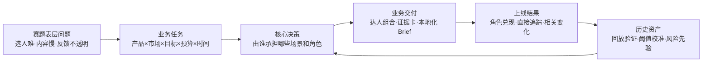
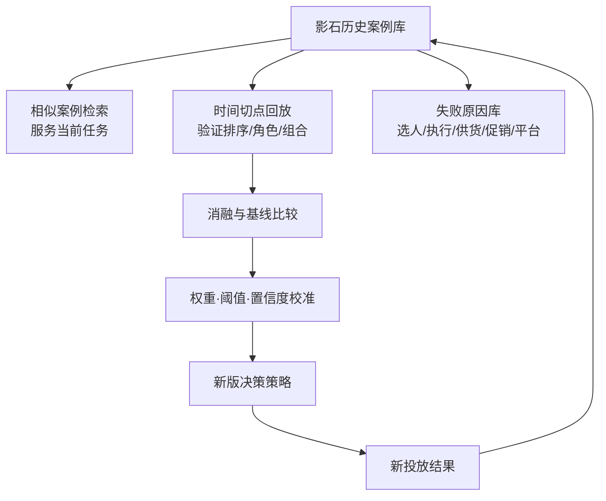
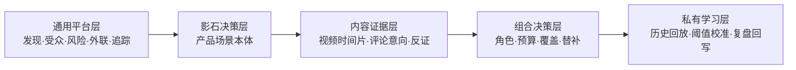

# 1. 先把赛题还原成一项业务决策

赛题给出了三类问题：海量达人难以筛选，合作内容生产慢，效果归因不透明。若按功能逐项作答，很容易得到“达人搜索、AI 文案、数据看板”三个松散模块。评委仍然看不清系统在什么时刻替谁作出什么决定。

我们将题目还原为 BD 团队每天面对的任务：一个确定的产品要进入确定的市场，品牌需要在预算和时间内完成若干内容场景，选择一组角色互补的创作者，形成可执行 Brief，上线后判断各自是否完成承担的任务，并把结果带回下一轮决策。

# 2. 三组矛盾决定了破题方向

## 2.1 候选规模远大于人工注意力

运动户外创作者跨平台、跨国家、跨语言分布。人工团队能够深入查看的账号始终有限，而真正需要判断的内容证据藏在视频片段、字幕、评论和受众反馈中。工程上应采用分层漏斗：先用低成本字段做召回和硬筛，再将昂贵的视频多模态与评论语义分析集中到少量高潜候选。

## 2.2 公开热度不等于任务价值

同一位创作者可能适合北美骑行通勤，却不适合潜水新品；可能擅长引发讨论，却未必能完成产品解释或转化。达人价值必须挂在具体任务上。市场、语言、合规和受众是准入约束，场景与角色决定排序，报价与风险决定组合。

## 2.3 选人判断与投放结果之间缺少可追溯关系

只给一个综合分，业务人员无法判断分数是否有依据；只看上线后的销售增长，也无法区分选人、内容执行、折扣、库存和平台分发的影响。系统需要在推荐时保留证据与反证，在上线前锁定角色和验收门槛，上线后按角色复盘。这样才能知道哪一环有效，哪一环需要调整。

# 3. 决策单位：从达人名单升级为任务组合

系统的最小分析单位是“达人×投放任务”。任务由产品、目标市场、目标场景、业务目标、预算、时间窗和风险要求构成。市场不是加分项：北美任务先排除不满足北美受众、语言或合规要求的账号，再比较剩余候选的任务价值。

最终输出是一组带角色的达人投资组合。每位达人承担明确职责，例如引爆讨论、规模扩散、深度解释、转化承接或潜力探索；同一关键场景保留替补，预算不无条件集中在一个头部账号。组合方案同时给出报价区间、预算占用、场景覆盖、角色覆盖、集中风险和替补可用性。

| 决策层 | 要回答的问题 | 系统输出 |
|-|-|-|
| 任务层 | 这次投放在哪个市场、完成哪些场景、追求什么结果 | 结构化 Task Brief 与硬约束 |
| 达人层 | 某位达人对本任务有什么价值，证据是否可靠 | 角色、分项得分、支持证据、反证、置信度 |
| 组合层 | 有限预算下选哪几位，如何分工和配置替补 | 主组合、备选组合、预算与覆盖分析 |
| 执行层 | 合作内容如何在当地真实表达产品价值 | 本地化 Brief、必拍镜头、表达边界与验收项 |
| 学习层 | 哪些判断经上线证实，下一轮如何调整 | 角色复盘、归因分层、历史样本与校准版本 |

# 4. 主链路：一次任务如何走完

> 说明：完整「业务主链」以《01｜方案总览与业务背景》第 3 章为权威版本，本节为本文视角下的流程呈现，不重复展开。

这条链解决了早期方案“模块都有、业务动作不清”的问题。每一步都有输入、处理、输出和下一位使用者；推荐结果可以继续进入预算审批和内容生产，投放结果也有明确位置回到下一轮。

# 5. 五个核心对象把链路连起来

| 对象 | 关键内容 | 贯穿环节 |
|-|-|-|
| Task Brief | 产品、市场、场景、目标、预算、时间、硬约束 | 任务创建—召回—组合—验收 |
| Creator Snapshot | 来源、快照时间、账号与内容字段、缺失和授权状态 | 召回—分析—历史回放 |
| Evidence Card | 视频时间片、字幕、评论、业务字段、反证、置信度 | 深评—人工复核—答辩演示 |
| Portfolio Plan | 成员、角色、预算、覆盖、替补、集中度、选择理由 | 决策—审批—执行 |
| Campaign Outcome | 内容执行、直接追踪、相关变化、混杂因素、角色兑现 | 上线—复盘—校准 |

# 6. 历史数据为何位于主链，而不是附加验证

历史合作数据有四种直接用途。第一，当前选人时检索相似产品、市场和场景的案例，为报价、风险和角色提供参照。第二，在不读取投放后信息的情况下，按当时的决策时间点重跑系统，检验排序、角色和组合判断。第三，根据回放结果调整权重、阈值和置信度，让系统逐步贴近影石自己的业务口径。第四，将失败原因拆成选人、执行、供货、折扣、平台分发等类型，减少同类错误重复发生。

历史数据的使用有明确边界。已经合作且有真实结果的“达人×任务”可以形成分级标签；未合作、未联系或当时未入选的达人没有结果，只能记录为未标注样本，不能直接当负样本。样本较少时，历史数据主要用于离线回放、规则校准和相似案例，不急于训练复杂模型。

# 7. 原始思路的保留、修正与升级

| 原始判断 | 当前处理 | 原因 |
|-|-|-|
| 选人—投放—归因—反哺形成主链 | 保留，并增加任务输入、角色分工、内容执行和结果状态 | 原方向正确，补齐业务交接后才能执行 |
| 归因是选人的评价函数 | 拆为直接追踪、相关变化、因果增量三层，并按角色评价 | 不同证据强度不能混写，销售也不是所有角色的统一目标 |
| 候选达人做全局排行榜 | 改为任务内排序，最终交付角色互补的组合 | 市场和场景会改变达人价值，业务购买的是组合结果 |
| 全球与场景作为推荐维度 | 市场/语言/合规前置为硬约束，场景和角色进入核心评分 | 避免用高内容分抵消市场不适配 |
| 未入选或未合作达人可作负样本 | 修正为未标注；负向结果只来自有真实合作结果的低兑现样本 | 未合作不能证明表现差，直接标负会复制历史选择偏差 |
| 多模态分析覆盖全部候选 | 改为漏斗式计算，只对前段候选分析代表视频和评论 | 控制 API、推理成本和处理时延 |
| 固定权重形成综合分 | 首期用透明规则与分项得分，后续按历史回放分市场/场景校准 | 便于解释、复核和版本管理 |

# 8. 与通用达人平台的差异落在哪里

成熟平台已经能够提供达人发现、受众画像、品牌安全、关系管理、Campaign 跟踪以及不同程度的 AI 推荐。方案的竞争力不能建立在“行业只有粉丝量排序”或“率先使用 AI”之上。我们将通用平台视为数据和工作流底座，把自建资源集中在与影石产品决策直接相关的四层。

| 能力层 | 通用工具可复用 | 影石需要形成的专有能力 |
|-|-|-|
| 候选与画像 | 达人库、受众、互动、品牌安全、外联状态 | 统一实体、任务快照、数据可信度与缺失降级 |
| 场景理解 | 通用内容标签与相似账号 | 骑行、滑雪、潜水、家庭旅行等产品场景本体及镜头条件 |
| 判断依据 | 账号级指标与摘要 | 绑定视频时间片、评论原文和反证的任务级证据卡 |
| 决策输出 | 名单或 shortlist | 带角色、预算、场景覆盖和替补的达人组合 |
| 持续学习 | 通用行业基准 | 影石历史合作的时间切点回放、失败原因和分层校准 |

这四层彼此相连：场景本体决定分析什么，内容证据支撑角色判断，组合决策把判断转成预算动作，真实结果再校准场景和角色规则。数据越积累，企业内部的案例、阈值与失败模式越难由外部工具替代。

# 9. 一个完整流程例子：北美骑行新品

任务设定为北美市场骑行新品，预算 10 万美元，目标包括新品认知、通勤场景解释和首轮转化验证。业务在 Task Brief 中指定英语内容、北美受众门槛、FTC 披露、核心场景和上线时间。

1. 系统从现有 KOL 工具、平台授权数据和内部达人库召回候选，先执行市场、语言、品牌安全和可联系状态筛查。
2. 低成本信号识别近期骑行内容占比、稳定互动、受众重合与异常风险，将候选缩到可深评范围。
3. 视频分析提取头盔/车把/胸前机位、路况、跟拍方式、第一视角稳定性和产品讲解结构；评论分析识别“如何固定”“夜间效果”“续航”“哪里购买”等问题。
4. 证据卡为每位达人给出适合场景、建议角色、可点击证据、反证和置信度。业务可以看到结论来自哪段内容。
5. 组合器在预算内选择 1 位引爆型、2 位深度解释/转化型、若干扩散与潜力型达人，同时确保通勤、长途、公路/山地等核心场景有主负责人与替补。
6. Brief 生成器将产品事实、场景证据和北美表达习惯合成合作草案，列出必拍镜头、信息边界、披露要求和验收项，由内容团队确认后发出。
7. 上线后通过 UTM、优惠码和平台内容数据记录直接结果，并同步标记折扣、库存、媒体加热和 Brief 偏离。复盘按预设角色判断兑现情况。
8. 本次结果进入历史库。下一次北美骑行任务可检索相似案例，离线回放则检验当时系统能否把高兑现达人排在前列。

# 10. 科研验证如何与业务方案联动

历史回放不单独占据业务流程，也不在系统上线前制造一道抽象的“验证关”。它依附于同一套对象和日志：Task Brief 定义当时的问题，Creator Snapshot 固定当时可见的数据，Evidence Card 保存判断，Campaign Outcome 提供事后结果。用同一条链重跑，才能检验推荐是否利用了未来信息、哪些信号真正有增量价值。

验证比较完整方案与粉丝量、互动率、受众匹配和当时人工名单等基线；通过消融检查视频深评、评论语义和历史案例各自贡献。排序用 NDCG@K、Precision@K 等指标，角色用 Macro-F1 和角色兑现率，组合用场景覆盖、预算集中度与替补可用率。结果只用于校准已经定义清楚的规则，不把一次相关性结果包装成因果结论。

# 11. 落地边界与诚实承诺

| 边界 | 方案处理 |
|-|-|
| 平台数据无法保证全量获取 | API、现有 KOL 工具和授权数据并用；记录来源、快照、权限和缺失原因 |
| 报价通常不公开且会变化 | 使用第三方区间、历史区间或人工录入；组合做上下界敏感性分析 |
| “未来会爆”存在平台与执行不确定性 | 输出角色概率、证据和置信度；保留反证及替补，不承诺确定爆款 |
| 销售变化受多重因素影响 | 区分直接追踪、相关变化和因果增量；记录促销、库存、媒体与执行偏离 |
| 历史选择存在偏差 | 未合作达人不标负；保留公开前瞻信号与潜力探索预算 |
| 生成内容涉及事实与合规 | 使用批准的产品知识库和地区规则；发布前人工审核 |

# 12. 开题阶段重点证明什么

首期演示集中在一条北美运动户外任务：从结构化需求进入候选漏斗，打开一张有视频时间片和评论证据的达人卡，生成三套可切换的组合方案，再展示 Brief 与上线复盘如何回到历史记录。技术深度通过样例视频多模态分析、评论意向分类、组合约束和历史回放体现，不追求在开题阶段全量连接所有平台。

评审应能清楚看到五件事：系统接收什么业务任务；为什么推荐这些达人；每个人在组合里承担什么职责；投放之后怎样判断职责是否兑现；新结果怎样让下一次判断更稳。产品需求 PRD至竞品研究与参考资料分别展开产品、指标、数据、回放、演示和资料，详细技术方案展开完整技术实现。

# 13. 方案结论

本方案以投放任务为起点，以场景和角色组织达人判断，以可点击证据支撑人工决策，以预算约束下的组合形成业务交付，以历史回放和真实复盘持续校准。它保留了原始思路中“选人—投放—归因—反哺”的主线，并补齐了市场硬约束、执行交接、组合目标、证据链与验证边界。由此形成一条能够演示、能够验收、也具备逐步生产化条件的完整业务链。

---

# 1. 研究问题与方法

资料研究围绕四个问题展开：现有达人平台已经解决了哪些发现、管理和衡量能力；平台官方 API 实际允许获取哪些数据；学术研究对“匹配、可信度、内容价值与购买意向”提供了什么证据；本方案的差异化应落在哪一层。

来源优先级为：平台/厂商官网与帮助中心、政府与平台官方规则、同行评审论文或原始研究。博客、媒体转述和无明确出处的市场数字不作为核心论据。

# 2. 竞品能力矩阵

| 产品 | 公开能力摘要 | 与本方案重合 | 本方案仍需自建/验证 | 官方来源 |
|-|-|-|-|-|
| HypeAuditor | 达人发现、账号分析、受众与欺诈/品牌安全、外联、关系和 Campaign 管理 | 候选召回、账号画像、风险初筛、执行管理 | 影石场景标签、视频时间片证据、评论意向、角色组合和私有历史校准 | [HypeAuditor 官网](https://hypeauditor.com/) |
| Modash | 发现与分析创作者；Campaign 可跟踪 Instagram/TikTok/YouTube 内容、互动、曝光、观看、成本、优惠码和收入 | 发现、账号数据、内容追踪、部分直接转化 | 任务级场景判断、证据卡、组合约束和时间切点回放 | [Modash Campaign 帮助页](https://help.modash.io/en/articles/5467242-creating-your-first-campaign) |
| CreatorIQ | 内容优先的发现、相似创作者、品牌安全、关系与流程、支付和衡量 | 内容发现、相似推荐、品牌安全、全流程管理 | 围绕影石产品/场景定义角色与组合；绑定内部历史结果的校准规则 | [CreatorIQ 官方方案页](https://www.creatoriq.com/influencer-marketing-solution) |
| Traackr | 发现与评估、Brief/邀请/审核/付款、实时跟踪；公开页面还描述 AI 辅助 shortlist、activation plan、内容风格/品牌/受众匹配及表现建模 | 方案规划、匹配、执行和衡量高度重合 | 差异不能只写“AI 选人”；需落在影石场景本体、视频/评论证据、组合目标函数和私有回放协议 | [Traackr 官方 Activate/Measure 页](https://www.traackr.com/influencer-tracking) |
| GRIN | 发现、招募、激活、Brief、履约、联盟链接/优惠码、Creator CRM 和结果分析；公开 AI 页面强调连接社媒、商业历史和品牌上下文 | 发现、执行、CRM、转化跟踪、历史关系数据 | 影石特有的内容场景标签、证据卡与多角色组合；离线回放的透明口径 | [GRIN 官方平台页](https://grin.ai/)；[Campaign 帮助页](https://help.grin.co/docs/setting-up-your-campaign) |

**判断。**公开信息已经表明，主流平台已经覆盖粉丝量之外的内容匹配、AI shortlist、计划与衡量。“AI 选人”“闭环”“生成 Brief”这些功能名称不足以构成强差异。影石可守住的部分包括：把产品使用场景定义成可计算任务；将公开视频和评论证据绑定到判断；以角色互补的组合作为决策对象；用自有历史合作结果按时间切点校准。评价指标与验收口径和历史回放验证负责检验这些能力是否成立。

# 3. 竞品对照后的产品定位

系统优先接入现有平台提供的通用数据和工作流，不重复建设大规模达人数据库。自建资源集中在现成工具难以替代、又直接决定影石业务质量的四层：场景定义、内容证据、组合决策、私有学习。

# 4. 平台数据可得性与技术边界

| 平台/规则 | 官方资料可确认的能力 | 对本方案的影响 | 来源 |
|-|-|-|-|
| YouTube Data API | 提供频道、视频、搜索、评论线程与评论等资源；commentThreads.list 可按视频获取评论线程并受配额约束 | 可支持公开视频元数据、内容样本和评论语义的首期验证 | [YouTube Data API Reference](https://developers.google.com/youtube/v3/docs)；[commentThreads.list](https://developers.google.com/youtube/v3/docs/commentThreads/list) |
| TikTok Display API | 在用户授权后读取基本资料及近期视频/视频查询；需开发者账号、产品审批和 Login Kit | 适合已授权创作者或合作后数据连接，不应把它写成全平台公开达人发现接口 | [TikTok Display API Overview](https://developers.tiktok.com/doc/display-api-overview/)；[Get Started](https://developers.tiktok.com/doc/display-api-get-started) |
| Instagram/Meta | 能力取决于账号类型、授权、权限和审核，需以实际应用权限为准 | 开题阶段列为条件可得；正式实施前由技术同学验证字段与历史深度 | [Instagram Platform 官方文档](https://developers.facebook.com/docs/instagram-platform/) |
| FTC 商业披露 | 与品牌存在付款、赠品等 material connection 时应清楚、显著披露；视频披露应出现在视频中，而非只放描述 | 北美 Brief 与内容审核必须包含披露检查，不把 #collab 等模糊表达默认视为充分 | [FTC Disclosures 101](https://www.ftc.gov/business-guidance/resources/disclosures-101-social-media-influencers) |

数据可得性是方案最大的工程约束。公开视频可见并不等于所有字段可稳定批量获取；评论关闭、授权撤回、API 配额、供应商口径和平台条款都会影响覆盖。系统应把来源、权限、快照时间和缺失原因作为一等字段。

# 5. 学术研究与方案映射

| 研究 | 设计与主要发现 | 对方案的启发 | 限制 |
|-|-|-|-|
| De Veirman, Cauberghe & Hudders (2017) | Instagram 实验研究了粉丝数与产品差异度对品牌态度的影响，说明“更多粉丝”并非脱离产品情境的普适答案 | 粉丝量只作为规模信号；匹配需要结合产品与场景 | Instagram、特定实验设置，不能直接外推到运动相机真实转化 |
| Lou & Yuan (2019) | 研究 branded content 的信息价值、可信度、信任与购买意向关系 | 内容解释力、可信度与评论中的真实问题应进入深评 | 基于问卷/结构模型，购买意向不等于实际订单 |
| Sokolova & Kefi (2020) | 基于法国美妆/时尚博主受众调查，可信度和拟社会互动与购买意向正相关 | 达人与受众关系、可信度不能被粉丝量代替；转化角色需要内容和关系证据 | 品类、地区和样本均与本项目不同 |
| Liu & Zheng (2024) | 研究信息价值、真实性、同质性、拟社会关系、品牌可信度和购买意向 | 把“内容信息价值、真实感、受众同质性”纳入指标，而非只看互动 | 仍以态度和意向为主，需要真实投放结果验证 |
| Foroughi et al. (2024) | 研究可信度、内容有效性、品牌参与和预期价值，并报告产品—达人契合的调节作用 | 支持把产品/达人契合作为任务相关变量 | 研究构念与系统场景标签不能直接等同 |
| Järvelin & Kekäläinen (2002) | 提出基于累计增益的排序评价，可用分级相关性和位置折损衡量检索结果 | 达人匹配具有多个相关等级，NDCG 适合衡量前列候选质量 | 是信息检索指标，不能替代业务结果与因果验证 |
| Rastogi et al. (2021) | 代理仿真显示达人选择与产品、消费者兴趣、预算和情境相关 | 支持“任务优先”和预算约束，而非固定全局榜单 | 仿真结论需用真实历史数据校验 |
| InfluencerRank (2023) | 使用图卷积和时序建模寻找有效影响者，强调从大量用户中识别有效达人 | 说明时序和网络信号有研究价值，可作为后续技术路线 | 复杂模型对数据规模和可得性要求高，不适合作为首期主方案 |

# 6. 核心论文原始链接

1. De Veirman, M., Cauberghe, V., & Hudders, L. (2017). *Marketing through Instagram influencers: the impact of number of followers and product divergence on brand attitude.* International Journal of Advertising. DOI：[10.1080/02650487.2017.1348035](https://doi.org/10.1080/02650487.2017.1348035)。
2. Lou, C., & Yuan, S. (2019). *Influencer Marketing: How Message Value and Credibility Affect Consumer Trust of Branded Content on Social Media.* Journal of Interactive Advertising. DOI：[10.1080/15252019.2018.1533501](https://doi.org/10.1080/15252019.2018.1533501)。
3. Sokolova, K., & Kefi, H. (2020). *Instagram and YouTube bloggers promote it, why should I buy? How credibility and parasocial interaction influence purchase intentions.* Journal of Retailing and Consumer Services. DOI：[10.1016/j.jretconser.2019.01.011](https://doi.org/10.1016/j.jretconser.2019.01.011)。
4. Liu, X., & Zheng, X. (2024). *The persuasive power of social media influencers in brand credibility and purchase intention.* Humanities and Social Sciences Communications. DOI：[10.1057/s41599-023-02512-1](https://doi.org/10.1057/s41599-023-02512-1)。
5. Foroughi, B. et al. (2024). *Determinants of followers' purchase intentions toward brands endorsed by social media influencers.* Journal of Consumer Behaviour. DOI：[10.1002/cb.2252](https://doi.org/10.1002/cb.2252)。
6. Järvelin, K., & Kekäläinen, J. (2002). *Cumulated gain-based evaluation of IR techniques.* ACM Transactions on Information Systems. DOI：[10.1145/582415.582418](https://doi.org/10.1145/582415.582418)。
7. Rastogi, C. et al. (2021). *Modeling Influencer Marketing Campaigns in Social Networks.* arXiv：[2106.01750](https://arxiv.org/abs/2106.01750)。
8. InfluencerRank (2023). *Discovering Effective Influencers via Graph Convolutional Attentive Recurrent Neural Networks.* arXiv：[2304.01897](https://arxiv.org/abs/2304.01897)。

# 7. 从研究到指标的对应关系

| 方案判断 | 资料支持 | 落地指标/功能 |
|-|-|-|
| 粉丝量不能单独决定适配 | De Veirman et al.；竞品普遍已加入受众和内容信号 | 粉丝量基线；任务级 NDCG；场景匹配 |
| 内容价值与可信度影响购买意向 | Lou & Yuan；Sokolova & Kefi；Liu & Zheng | 信息解释力、真实感、评论意向、转化角色 |
| 产品—达人契合需要显式建模 | Foroughi et al.；Rastogi et al. | 产品/场景任务 Brief；达人×任务评分 |
| 前列候选质量比全局准确率更重要 | Järvelin & Kekäläinen | NDCG@10、Precision@10、Recall@10 |
| 时序信号可能有价值，但需防泄漏 | 时序/图模型研究；平台指标随时间变化 | 快照、decision_cutoff_at、历史回放 |
| 商业披露是北美上线硬要求 | FTC 官方指南 | Brief 必填、上线审核、证据卡合规状态 |

# 8. 资料结论

行业已经具备成熟的达人发现、分析、管理和衡量工具，强方案不能建立在“别人都没有 AI”这一前提上。影石真正有机会形成壁垒的部分，是将运动相机的具体使用场景、公开视频与评论证据、角色化投资组合以及私有历史结果连成一套决策语言。它是否成立，最终由排序提升、组合质量、业务采纳和角色兑现共同验证。