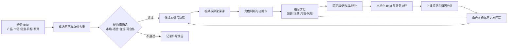
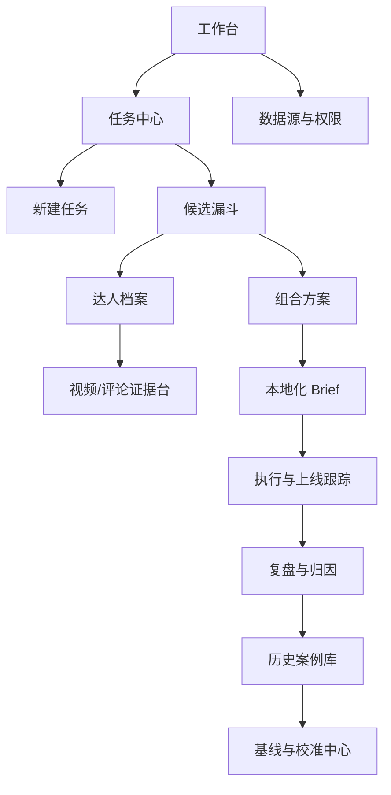

# 1. 产品概述

## 1.1 业务问题

当前达人投放的主要成本集中在三个环节：候选池依赖人工经验，覆盖范围有限；筛选依据分散在账号、视频、评论和历史合作记录中，结论难以复核；投放复盘通常停留在曝光、互动或销售结果，没有回到“当初为什么选这个人、他在组合中承担什么角色”。因此，同类任务每次都要重新搜人、重新判断，经验难以沉淀。

系统面向具体产品、市场、场景和目标组织候选人。市场与合规条件先做硬筛，场景任务决定内容判断，预算与目标决定组合结构。单个达人评分只作为中间结果，最终交付物是含角色分工、预算配置、证据来源、替补方案和本地化 Brief 的达人投资组合。

## 1.2 产品目标

| 目标 | 业务含义 | 首期验收信号 |
|-|-|-|
| 提高候选覆盖 | 从少量熟人池扩展至可追溯的跨平台候选池 | 候选来源、去重关系和筛选原因均可查看 |
| 降低深评成本 | 先用低成本信号缩小范围，再调用视频与评论深度分析 | 进入深评的候选不超过原始池的 5% |
| 形成可执行组合 | 按引爆、扩散、转化、潜力探索角色配置预算和场景 | 核心场景覆盖不低于 90%，组合预算不超任务上限 |
| 让结论可复核 | 每个判断绑定原始视频、评论、数据时间和置信度 | 进入推荐组合的关键结论证据可追溯率 100% |
| 让系统持续校准 | 投放结果连同执行条件回写历史库，更新权重和阈值 | 复盘完成后形成角色兑现标签和下一轮校准记录 |

## 1.3 非目标

首期不承诺自动替代 BD 的商务谈判，也不训练依赖大样本的黑箱模型；不将没有合作过的达人标为“失败样本”；不把曝光、相关销售或品牌词变化直接表述为因果增量。报价、档期、授权范围和品牌安全等关键事项仍需业务人员确认。

# 2. 用户与权限

| 角色 | 主要任务 | 关键权限 |
|-|-|-|
| 项目负责人 | 创建任务、确认目标与预算、选择组合、查看复盘 | 创建与审批任务；发布组合；关闭项目 |
| 市场/BD | 补充达人关系、报价与档期，发起沟通，提交人工判断 | 编辑商务字段；调整候选状态；维护沟通记录 |
| 内容策略 | 审核场景、内容风格、脚本与本地化 Brief | 复核证据；编辑内容约束；确认角色分工 |
| 数据分析 | 维护指标口径、历史回放、权重与阈值版本 | 配置基线；执行回放；发布校准版本 |
| 系统管理员 | 管理数据源、账号权限和审计日志 | 连接数据源；管理字段；处理合规与删除请求 |

# 3. 业务主链

> 说明：完整「业务主链」以《01｜方案总览与业务背景》第 3 章为权威版本，本节为本文视角下的流程呈现，不重复展开。

流程中有四个明确的人工作业点：任务约束确认、深评结论复核、组合发布审批、投放结果复盘。系统负责扩大覆盖、统一判断和保留证据；人负责确认上下文、处理例外与承担最终业务决策。

# 4. 信息架构与页面地图

# 5. 核心页面需求

## 5.1 工作台与任务中心

**页面目的。**让负责人快速看到待处理任务、异常节点和最新组合进展。任务卡展示产品、市场、目标、预算、负责人、当前阶段、候选数量和待办事项；支持按市场、产品线、状态和时间筛选。

**新建任务输入。**必填项包括产品 SKU、目标市场、投放窗口、核心场景、主目标、总预算、平台范围和不可违反的品牌/合规要求。选填项包括目标人群、竞品避让、历史案例引用、已知达人名单、内容交付形式和归因方式。

**规则。**市场、语言、投放期、预算和核心场景缺一时不得进入候选召回；系统应检查“北美任务却选择非目标市场达人”等明显冲突，并要求负责人修正或书面豁免。

## 5.2 候选召回与漏斗页

**页面目的。**把“搜到谁、为什么留下、为什么排除”放在同一条链上。候选按照原始池、硬筛通过、信号初筛、深评、组合入选五层展示，可切换看板和表格视图。

| 阶段 | 主要输入 | 系统处理 | 页面输出 |
|-|-|-|-|
| 候选召回 | 关键词、场景种子、相似达人、历史合作池、第三方工具 | 跨平台实体对齐、账号去重、来源记录 | 统一 creator_id 与来源标签 |
| 硬筛 | 市场、语言、平台、品牌安全、合作状态 | 规则判定；缺失字段进入待确认 | 通过/排除/待确认及原因 |
| 信号初筛 | 内容主题、增速、互动质量、受众重合、报价区间 | 低成本特征计算与初步排序 | 深评候选和触发理由 |
| 深度评估 | 代表视频、评论样本、商业内容记录 | 多模态理解、意向语义、角色判断 | 证据卡、置信度、人工复核状态 |

**关键交互。**用户可批量调整候选阶段，但必须选择原因；可锁定“必看达人”；可查看模型版本与快照时间；信息不足的达人进入补数队列，暂不判为不合格。

## 5.3 达人档案与证据台

达人档案由账号概览、受众与市场、内容场景、商业历史、视频证据、评论证据和风险记录组成。所有统计值显示数据源与抓取时间，历史值以快照呈现，避免用投放后的数据解释投放前的选择。

**视频分析。**系统对代表内容标注场景、拍摄视角、产品承载方式、叙事结构、可模仿动作、前三秒钩子、口播/字幕语言和品牌露出位置。每个标签可回到具体视频及时间片。

**评论分析。**评论按购买意向、价格/渠道询问、产品功能问题、使用顾虑、场景共鸣和无关互动分类；展示样本量、抽样方法、原文、翻译和置信度。评论区热闹但缺少产品讨论时，不得直接推断转化能力。

**证据卡。**结论、证据、反证、数据时间、算法/人工来源、置信度和适用角色必须同时存在。无法提供证据的结论以“待验证”显示，不进入自动推荐理由。

## 5.4 组合方案页

组合页以任务目标和预算为约束，安排不同角色：引爆负责制造高势能内容样板，扩散负责覆盖不同细分场景与人群，转化负责回答产品问题并承接购买意向，潜力探索用小预算验证尚未被市场充分定价的创作者。个人排序只负责提供候选输入。

| 组合输出 | 适用偏好 | 页面必须展示 |
|-|-|-|
| 稳定版 | 优先控制执行风险和预算波动 | 角色、预算、场景覆盖、历史相似案例、主要风险 |
| 进攻版 | 允许更高波动，争取内容势能和新达人红利 | 探索预算、上行空间、失败边界、停止条件 |
| 关键替补 | 处理拒绝、涨价、档期或合规变化 | 替代对象、替代后预算/覆盖/风险变化 |

**What-if 交互。**移除、替换或调整某位达人预算时，系统实时重算总预算、单人集中度、核心场景覆盖、角色缺口和风险暴露。若单一达人预算占比超过任务阈值，或核心场景出现空缺，页面给出明确警告。

## 5.5 本地化 Brief 页

Brief 由任务信息、达人画像和地区规则共同生成。结构包括：受众与场景、内容目标、产品卖点优先级、可采用的内容动作、必要镜头、CTA、披露要求、禁区、交付格式和验收标准。生成内容仅作为初稿，内容策略人员确认后方可发送。

系统应支持不同角色的差异化要求：引爆型强调强钩子和可复刻内容动作；扩散型强调细分场景自然植入；转化型强调真实体验、问题解答和链接/优惠码；潜力探索型控制制作成本并设置最小验证信号。

## 5.6 执行、上线跟踪与复盘页

执行页记录联系人、报价、合同、寄样、脚本、审核、发布时间、链接/优惠码和异常情况。上线后分三层展示结果：可直接追踪的点击、订单、优惠码与联盟链接；与投放同期变化相关的搜索、讨论、自然流量和销售；在有对照或实验设计时才展示的增量结果。

复盘按角色分别判断是否兑现。引爆型看内容峰值与外溢，扩散型看增量触达与场景覆盖，转化型看意向到点击/订单，潜力探索型看单位成本和后续成长。负责人必须记录执行条件，包括折扣、大促、新品发布、媒体投放、内容质量和断货等混杂因素。

## 5.7 历史案例库与校准中心

历史库保存任务快照、候选快照、最终组合、执行条件、结果和角色兑现标签。它有三项直接用途：在新任务中检索相似案例，为候选判断提供先验和风险参照；按投放前时间切点做离线回放，检验系统能否把后来表现更好的达人排在前面；根据长期误差校准权重、阈值和置信度。

校准版本必须记录生效时间、样本范围、改动原因、离线结果和审批人。任何历史回放只允许使用决策时已经存在的数据，未合作达人保持“未标注”，不得当成负样本。

# 6. 功能需求清单

| ID | 需求 | 优先级 | 验收要点 |
|-|-|-|-|
| FR-001 | 任务 Brief 结构化创建与冲突校验 | P0 | 必填项完整；跨市场冲突可拦截 |
| FR-002 | 多来源候选接入、统一身份和来源追踪 | P0 | 同一达人跨平台可关联；原始来源保留 |
| FR-003 | 硬筛规则、待确认状态与排除理由 | P0 | 所有排除可解释、可撤销、可审计 |
| FR-004 | 低成本初筛与深评成本门控 | P0 | 仅高潜或人工指定候选进入深评 |
| FR-005 | 视频场景与内容结构分析 | P0 | 标签绑定视频与时间片，可人工修订 |
| FR-006 | 评论购买意向与顾虑分析 | P0 | 显示样本量、原文、分类和置信度 |
| FR-007 | 角色判断与证据卡 | P0 | 支持反证、待验证和人工复核 |
| FR-008 | 组合优化与稳定/进攻方案 | P0 | 满足预算、场景、角色和集中度约束 |
| FR-009 | 替补与 What-if 重算 | P1 | 替换后 3 秒内返回预算和覆盖变化 |
| FR-010 | 本地化 Brief 生成与审批 | P1 | 角色差异、地区披露和禁区完整 |
| FR-011 | 执行台账与三层归因 | P0 | 直接、相关、增量三类结果分开展示 |
| FR-012 | 角色复盘与历史回写 | P0 | 完成复盘后形成可复用案例快照 |
| FR-013 | 版本、血缘和审计日志 | P0 | 结论可追到数据、规则、模型和人工操作 |

# 7. 核心数据对象与状态

| 对象 | 关键字段 | 生命周期 |
|-|-|-|
| Task | 产品、市场、场景、目标、预算、窗口、约束 | 草稿→待确认→筛选中→组合审批→执行中→已复盘 |
| Creator | 统一身份、平台账号、市场语言、受众、风险 | 候选→通过/排除/待确认→深评→入选/替补 |
| Evidence | 结论、来源、原文/片段、时间、置信度、反证 | 机器生成→待复核→已确认/驳回→过期 |
| Portfolio | 达人、角色、预算、场景、替补、风险、版本 | 生成→编辑→审批→锁定→变更→归档 |
| CampaignResult | 曝光互动、点击订单、搜索讨论、执行条件 | 采集中→已校验→已归因→已回写 |
| CalibrationVersion | 权重、阈值、样本、回放结果、审批信息 | 草稿→验证→审批→生效→退役 |

# 8. 非功能要求

**性能与成本。**普通筛选页面 3 秒内返回；高成本视频分析异步执行并显示进度。每个任务记录 API、第三方数据和模型调用成本，以“深评候选占比”和“单任务分析成本”设置门控。

**可追溯。**推荐组合中的每个关键结论必须带数据源、快照时间、规则/模型版本与人工修改记录。原始证据删除或失效时，结论自动降级为“证据不可用”。

**安全与合规。**遵循最小权限原则；内部报价、合同和转化数据与公开数据分区存储；个人信息只保留业务所需字段；支持数据删除、访问日志和保留期配置。北美内容必须包含可见的商业合作披露检查。

**稳定性。**第三方数据源不可用时，任务进入降级模式并标出缺失范围，不使用旧数据冒充实时数据；所有外部字段都保留 last_updated_at。

# 9. MVP 范围与实施路径

| 阶段 | 范围 | 退出条件 |
|-|-|-|
| MVP：跑通闭环 | 单一北美市场；YouTube/TikTok 为主；任务、漏斗、证据卡、组合、复盘 | 可用真实历史案例完成端到端回放和一次业务试用 |
| V1：接入执行 | Brief、商务状态、上线跟踪、替补 What-if、数据质量台 | 业务采纳率达到初始目标，异常可被定位 |
| V2：持续校准 | 多市场、多产品；自动相似案例；权重/阈值版本管理 | 跨任务稳定优于粉丝量/互动率等基线 |

# 10. 风险、依赖与人工复核项

| 事项 | 风险 | 处理方式 | 提交前责任人 |
|-|-|-|-|
| 历史合作样本规模 | 样本少导致指标波动 | 先用规则与轻量模型，报告置信区间和分层结果 | 数据同学人工复核 |
| 报价与档期 | 公开信息不完整或变化快 | 使用区间与时间戳；发布组合前由 BD 确认 | BD 人工复核 |
| 平台 API 边界 | 候选发现和评论数据受授权、配额限制 | 建立来源可得性分级；设计第三方采购或人工补数 | 技术/法务人工复核 |
| 归因表述 | 同期变化被误解为因果 | 直接追踪、相关变化和增量实验分层展示 | 数据同学人工复核 |
| 指标目标 | 缺少历史基线时目标过于武断 | 保留初始验收值，完成基线测算后校准并留版本 | 项目负责人审批 |

# 11. PRD 验收结论

当一名业务人员能够从北美骑行场景任务出发，完成候选召回、硬筛、深评、证据复核、组合选择、Brief 生成、上线记录和角色复盘，并且任何推荐都能回到当时可见的证据与版本，本产品的核心闭环才算成立。单纯产出一张达人排名表不构成验收通过。
