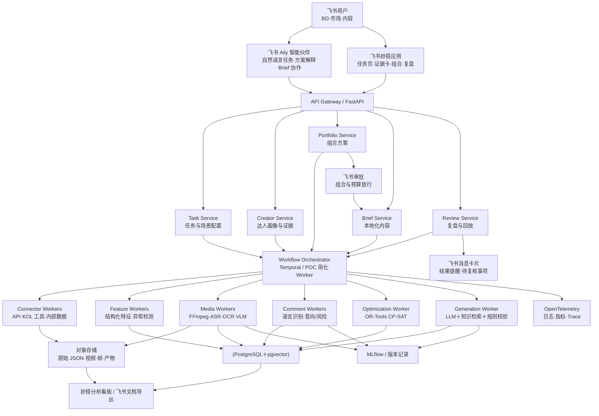
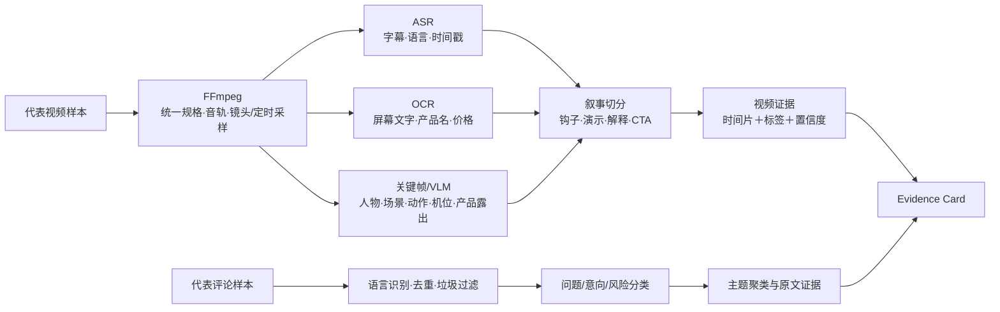
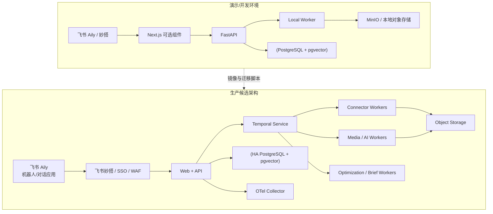
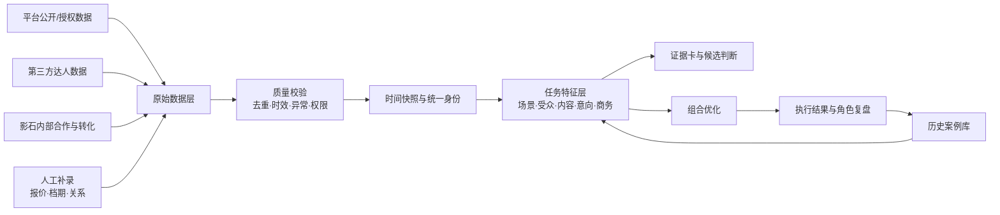

# 1. 技术目标与实施原则

| 原则 | 工程要求 |
|-|-|
| 任务相关 | 所有评分均以 task_id 为上下文；不存在脱离产品、市场和场景的固定全局分 |
| 硬约束前置 | 市场、语言、受众、品牌安全、合规和可联系状态在排序前执行，不由综合分抵消 |
| 证据可追溯 | 关键结论绑定 source_id、时间戳、视频时间片、评论或业务字段，同时保留反证 |
| 时间可回放 | 所有外部字段带 observed_at；历史验证只读取 decision_cutoff_at 前的快照 |
| 成本分层 | 结构化信号覆盖大池，昂贵的视频多模态和评论推理只作用于前段候选 |
| 人机协同 | 系统给建议、证据和置信度；报价、关系、档期、内容审批和上线放行保留人工确认 |
| 供应商可替换 | LLM、视觉模型、Embedding 和数据供应商均通过适配器调用，避免绑定单一服务 |

# 2. 建设范围

## 2.1 首期包含

- 结构化 Task Brief、场景模板与硬约束配置。
- 内部达人库、现有 KOL 工具和条件允许的平台 API 连接器。
- 候选实体归一、分层召回、硬筛和低成本特征计算。
- 样例视频的关键帧、字幕、OCR、场景和叙事分析；评论问题/意向/风险分类。
- 任务级证据卡、角色判断、分项得分与置信度。
- 预算、角色、场景、集中度和替补约束下的达人组合。
- 基于批准产品资料和地区规则生成的本地化合作 Brief。
- 上线结果采集、归因分层、角色复盘、历史回放与版本校准。

## 2.2 首期不承诺

- 绕过平台权限全量抓取所有创作者、评论和受众数据。
- 自动完成私信、谈判、签约、付款及内容发布。
- 在无报价数据时输出单点精确价格。
- 在无对照组或准实验条件时宣称销售因果增量。
- 用少量历史样本训练能跨市场稳定泛化的复杂预测模型。

# 3. 总体架构

架构按服务边界组织，但首期可部署为模块化单体：一个 FastAPI 服务、一个异步 Worker、PostgreSQL/pgvector、对象存储和前端。只有数据量、并发和团队规模达到需要时，才拆分成独立服务。Temporal 适合生产阶段编排跨 API、文件处理和模型调用的长任务；演示版可用同一工作流接口连接轻量队列或本地 Worker，减少基础设施负担。

## 3.1 飞书 AI 能力的业务落点

系统采用飞书 Aily 智能伙伴作为面向 BD 和市场人员的 AI 协作入口。用户可以在飞书单聊或项目群中描述“北美骑行新品、10 万美元预算、需要认知和转化验证”等需求；Aily 通过多轮对话补齐市场、产品、场景、角色、预算、时间与合规字段，再调用本系统技能接口生成 Task Brief。组合完成后，Aily 读取系统返回的结构化结果和证据引用，回答“为什么选这位达人”“替补是谁”“放宽预算会怎样”等业务问题，并为已批准达人生成本地化 Brief 草案。

Aily 负责自然语言理解、工作流编排、知识检索与协作交互；候选硬筛、视频与评论分析、任务级评分、组合求解和历史回放仍由后端决策服务完成。这样的边界可以保留核心算法的可测试性，也让飞书 AI 直接进入任务创建、方案解释和内容协作三个高频动作。

## 3.2 Aily 工作流与技能接口

| Aily 节点 | 输入 | 调用/处理 | 输出与门禁 |
|-|-|-|-|
| 需求澄清 | 用户自然语言、当前群聊上下文 | 智能对话节点＋必填字段检查 | TaskDraft；缺失市场、产品、目标或预算时继续追问 |
| 知识检索 | product_id、market | 检索已批准的产品事实、场景本体、地区合规知识 | knowledge_refs；过期或未批准内容禁止进入生成 |
| 任务创建技能 | TaskDraft＋knowledge_refs | 调用 /v1/ai/task-drafts/validate 与 /commit | task_id、task_version、warnings；用户确认后才提交 |
| 方案解释技能 | task_id、portfolio_id、用户问题 | 调用 /v1/ai/portfolios/{id}/explain，返回结构化结论与 evidence_ids | 飞书消息卡片；无证据的结论不展示为确定判断 |
| 情景比较技能 | 预算或约束调整 | 调用 /v1/tasks/{id}/portfolios 重新求解 | 新旧组合差异、覆盖和风险；不覆盖已批准版本 |
| Brief 生成 | 已批准 portfolio、达人角色、知识引用 | Aily 工作流调用 Brief Service，执行事实/披露/禁用词校验 | Draft 状态飞书文档；内容人员批准后方可发送 |

Aily 的系统提示词要求所有达人判断引用 evidence_id，工具调用返回固定 JSON Schema，并将 task_id、portfolio_id、strategy_version 和 knowledge_version 写入会话结果。对话历史用于理解追问，不作为新的业务事实来源；用户在对话中修改预算或市场时，系统生成新任务版本并要求二次确认。

# 4. 技术栈与选型

| 层级 | 首选技术 | 用途 | 选型说明 |
|-|-|-|-|
| 飞书 AI 入口 | 飞书 Aily 智能伙伴 | 自然语言任务澄清、技能编排、方案问答、知识检索与 Brief 协作 | 发布为飞书机器人/对话应用；关键结论必须由后端证据接口提供 |
| 业务应用 | 飞书妙搭；复杂组件按需使用 Next.js＋React＋TypeScript | 任务配置、漏斗、证据卡、组合、Brief 与复盘页面 | 首期优先在飞书内完成协作；复杂可视化通过自定义前端接入 |
| 飞书协作 | 审批、消息卡片、云文档 OpenAPI | 预算/组合放行、待办提醒、Brief 与复盘沉淀 | 审批状态写回 portfolio_version，避免生成内容绕过人工门禁 |
| API | FastAPI＋Pydantic | REST API、输入校验、OpenAPI 文档、异步 I/O | Python 与数据/模型栈衔接直接；清晰定义接口对象 |
| 任务编排 | 生产：Temporal；演示：轻量 Worker | 数据拉取、媒体处理、重试、暂停、人工审核回调 | 生产长任务需要持久状态、幂等和失败恢复；原型先减配 |
| 主数据库 | PostgreSQL | 任务、达人、快照、证据、组合、版本和结果 | 事务、关系约束和时间快照适合核心业务数据 |
| 向量检索 | pgvector | 场景文本、内容摘要、产品资料和相似案例检索 | 向量与业务表共库，首期运维简单；支持精确与近似检索 |
| 对象存储 | S3 兼容存储 / MinIO | 原始响应、视频、关键帧、字幕、报告和模型产物 | 大文件与结构化数据库分离；用内容哈希去重 |
| 缓存/限流 | Redis（按需） | API 配额、热点结果、短期锁和任务进度 | POC 可不启用；不将 Redis 作为最终事实来源 |
| 媒体处理 | FFmpeg | 转码、音轨抽取、关键帧/定时采样、缩略图 | 成熟、可脚本化；在模型调用前统一媒体规格 |
| 语音/OCR | Whisper 类 ASR 适配器；PaddleOCR/云 OCR 适配器 | 字幕、语种、屏幕文字和产品信息提取 | 根据准确率、语言覆盖、隐私和成本做基准后选型 |
| 多模态理解 | VLM Provider Adapter | 场景、机位、产品露出、叙事结构和内容风险 | 接入一个主模型与一个备选模型；输出 JSON Schema，保留版本 |
| 文本理解 | 规则＋Embedding＋LLM 分类 | 评论问题、购买意向、真实性、风险和主题聚类 | 高频明确规则先行，语义分类处理长尾；抽样复核 |
| 组合优化 | Google OR-Tools CP-SAT | 预算、角色、场景、集中度和替补约束求解 | 适合离散选择与整数约束，可返回可行/最优状态 |
| 实验与版本 | MLflow＋Git＋数据库版本表 | 模型、Prompt、数据集、阈值、离线指标和产物追踪 | 将一次回放的参数、代码版本和结果绑定 |
| 可观测性 | OpenTelemetry＋Prometheus/Grafana 或现有平台 | Trace、日志、时延、失败率、调用量与成本 | 供应商无关；可把一次任务跨服务链路串起来 |
| 部署 | Docker Compose（演示）；Kubernetes/托管容器（生产可选） | 环境一致、弹性 Worker 和隔离 | 先证明业务价值，达到并发需求后再引入集群复杂度 |

# 5. 数据分层与时点设计

| 层 | 内容 | 写入策略 | 主要用途 |
|-|-|-|-|
| Raw | API 原始 JSON、供应商导出、媒体文件、人工上传 | 只增不改；保存 source、requested_at、observed_at、hash | 审计、重放、字段变化排查 |
| Normalized | 统一达人、账号、内容、评论、受众、报价与合作记录 | 实体映射与字段标准化；保留来源优先级 | 检索、硬筛、业务页面 |
| Snapshot | 某任务决策时可见的达人和内容状态 | 生成 immutable snapshot_id | 推荐、历史回放、防止未来泄漏 |
| Feature | 结构化、文本、视频、评论和时序特征 | 记录 feature_version、input_hash、computed_at | 分项评分、消融、模型输入 |
| Decision | 硬筛原因、角色、得分、证据卡、组合和 Brief | 版本化；人工改动追加记录 | 审批、解释、复盘 |
| Outcome | 上线内容、成本、直接追踪、相关变化、混杂因素和角色标签 | 按窗口追加；保留修订人和依据 | 效果看板、历史回放、校准 |

所有外部观测至少包含 source_id、source_type、observed_at、ingested_at、permission_scope、raw_uri 和 data_quality_status。历史回放以 observed_at ≤ decision_cutoff_at 为强约束；任何缺失快照的数据默认不能进入该批验证。

# 6. 端到端处理流程

# 7. 模块一：任务与场景本体

## 7.1 输入

task_id、product_id、market、languages、objective、budget_min/max、launch_window、required_scenes、optional_scenes、role_targets、platforms、audience_constraints、risk_policy、compliance_profile、max_creator_share 与替补要求。

## 7.2 处理

Task Service 按产品和地区模板检查完整性，将自然语言需求映射到受控场景本体。场景节点包含场景名称、同义词、环境、主体、动作、机位、关键产品能力、必拍证据与排除条件。例如“北美骑行通勤”关联第一视角、车把/头盔机位、路况变化、稳定、防抖、夜间和安装问题。

## 7.3 输出

冻结的 task_version、hard_constraints、scene_query、role_definition 和 acceptance_rule。任务变更产生新版本，不覆盖已经用于推荐或回放的旧版本。

# 8. 模块二：多源召回、实体归一与硬筛

## 8.1 数据连接

连接器按统一接口实现 discover、fetch_profile、fetch_contents、fetch_comments 和 fetch_audience。首期优先读取现有 KOL 工具/内部表及可合法取得的平台数据。每个连接器实现配额、退避、断点、字段映射和权限状态；平台不提供的字段不通过推断伪造。

## 8.2 实体归一

用平台账号 ID 作为强键，主页 URL、公开邮箱、跨平台链接和人工确认作为辅助键，建立 creator_id 与 platform_account_id 的一对多关系。模糊匹配只产生候选映射，冲突进入人工合并队列；合并和拆分均保存审计日志。

## 8.3 召回策略

- 结构化召回：市场、语言、类目、受众、规模区间和平台。
- 语义召回：场景描述与内容标题/字幕/摘要向量相似度。
- 相似案例召回：与历史高兑现达人在产品、场景和内容结构上相近。
- 探索召回：近期增长或场景迁移明显、但历史合作不足的潜力账号。

## 8.4 硬筛结果

每项 hard_filter 输出 pass、fail 或 unknown。unknown 不自动等于 fail，可按任务政策进入“需人工确认”。常见原因包括市场受众不足、语言不符、品牌安全风险、内容合规风险、长期停更、不可联系或平台权限不足。

# 9. 模块三：低成本信号层

该层覆盖大部分候选，只使用结构化元数据和轻量文本，目标是稳定缩小候选池，不在此阶段给出最终业务结论。

| 特征组 | 示例 | 处理 |
|-|-|-|
| 规模与稳定性 | 粉丝、近 N 条观看中位数、波动、发帖频率 | 对数变换、平台/量级归一、异常值截尾 |
| 互动质量 | 互动率、评论/播放、重复评论、异常峰值 | 分位数、机器人/互刷风险、缺失降级 |
| 受众 | 目标国家、年龄、语言、兴趣 | 来源置信度；无授权时只保留可见代理信号 |
| 内容相关 | 近 90/180 天场景内容占比、产品邻近度 | 关键词＋Embedding 召回；抽样核验 |
| 增长势能 | 粉丝/观看斜率、爆款后留存、内容连续性 | 时间窗对比；避免用单条异常内容代表趋势 |
| 商业与风险 | 广告密度、竞品近期合作、披露、舆情 | 规则标记＋人工复核 |

输出 pre_score、feature_completeness、risk_flags 与进入深评的 priority。进入深评数量同时受相对排名、探索配额和单任务计算预算控制，避免只保留成熟头部。

# 10. 模块四：视频多模态与评论语义深评

## 10.1 视频抽样

每位达人优先分析与目标场景最相关、近期且表现有代表性的 5–10 条内容，同时保留 1–2 条低表现内容用于反证。视频先按内容哈希查缓存；FFmpeg 统一分辨率和帧率，按镜头边界与固定间隔抽取关键帧，避免将整段视频逐帧送入模型。

## 10.2 多模态输出 Schema

每个视频输出 scene_tags、environment、activity、camera_mount、shot_types、product_presence、hook_type、demo_steps、proof_moments、cta_type、brand_safety、timestamps、evidence_text 和 confidence。模型只能从预定义枚举选择核心标签；无法判断时返回 unknown，禁止补全不存在的镜头。

## 10.3 评论语义

评论先去重、过滤垃圾与识别语言，再分类为使用问题、产品能力问题、安装/兼容、价格/购买、比较竞品、真实体验、负面风险和无关互动。系统保留经脱敏的原文、content_id、comment_id、语言、时间和分类置信度，主题占比只作为辅助信号。

## 10.4 质量控制

按市场和语言构建人工标注集；视频场景报告 Macro-F1、证据时间片命中率和无依据率，评论报告 Macro-F1、购买意向 Precision、风险 Recall 与跨语种差值。任何高置信结论若无法指向原始证据，按错误处理。

# 11. 模块五：证据卡、角色与任务级评分

Evidence Service 将结构化字段、视频片段、字幕、评论和历史案例统一成 EvidenceItem。每条证据包含 claim_type、direction（支持/反证）、source_type、source_ref、time_range、extract、observed_at、model_version、confidence 和 reviewer_status。

首期评分采用透明加权与门槛。对候选 i、任务 t、角色 r：

`Score(i,t,r) = w1·MarketFit + w2·SceneFit + w3·ContentCapability + w4·AudienceFit + w5·RoleSignal + w6·Momentum − w7·Risk − w8·CostPenalty`

权重按任务类型和角色配置；各分项保存原始特征、归一方式和证据。若 MarketFit 或合规硬约束不通过，候选不进入评分。综合置信度由数据完整度、证据一致性、模型校准度和数据新鲜度共同决定，不能直接等同于得分。

| 角色 | 关键能力信号 | 主要反证 |
|-|-|-|
| 引爆 | 相对个人基线的传播峰值、可模仿结构、话题外溢、二次传播 | 爆款仅来自偶发热点；与产品场景无关 |
| 扩散 | 稳定有效观看、目标受众覆盖、内容产能和单位触达成本 | 受众重叠严重；观看波动或异常 |
| 深度解释/转化 | 演示步骤、信息价值、问题回答、购买/安装评论、直接追踪历史 | 商业内容跳过使用证据；CTA 强但信任弱 |
| 潜力探索 | 场景纯度、增长连续性、低成本、内容质量上升 | 样本过少；增长来自单条偶发内容 |

# 12. 模块六：达人组合优化

组合层将业务限制写成可检查的约束。设 x_i∈{0,1} 表示是否选择达人 i，c_i 为报价中心或区间，u_i 为任务效用，cover\_{i,s} 表示达人是否覆盖场景 s，role\_{i,r} 表示是否承担角色 r。

`最大化 Σ(u_i·x_i) + λ1·场景覆盖 + λ2·角色覆盖 + λ3·探索价值 − λ4·预算集中风险 − λ5·受众重叠 − λ6·数据不确定性`

主要约束：

- `Σ(c_i·x_i) ≤ Budget`；报价为区间时分别求解下界、中心和上界情景。
- 每个核心场景至少 1 位主负责达人；关键场景按任务要求再配置 1 位替补。
- 每个必需角色满足最少人数或预算占比。
- 单个达人预算占比不超过 max_creator_share，专项头部合作可由业务审批豁免。
- 同质受众、同一管理机构或高关联账号可设置同时入选上限。
- 高风险、数据过期或档期未知的候选必须满足人工确认条件。

OR-Tools CP-SAT 返回求解状态、目标值与组合。系统至少生成“稳健”“均衡”“探索”三套可比方案，并解释每项差异。如果无可行解，返回冲突约束和建议放宽项，不静默删掉业务限制。

# 13. 模块七：本地化 Brief 生成

## 13.1 检索来源

只从批准知识库读取产品规格、功能边界、禁用说法、品牌语气、目标市场表达、FTC/平台披露要求、历史高质量案例和本次达人证据。知识条目带版本、适用地区、生效时间与审批状态。

## 13.2 生成步骤

1. 根据 Task Brief、达人角色和证据卡生成内容策略骨架。
2. 检索本次产品事实、必拍场景、地区规则和表达词库。
3. LLM 按 JSON Schema 生成 hook、镜头顺序、关键信息、CTA、披露和禁区。
4. 规则校验产品参数、禁用词、必填披露、场景覆盖和长度。
5. 再生成面向创作者的自然语言 Brief，标注引用的知识条目。
6. 内容/法务人员审阅，修改记录作为模板改进材料；未经批准不得直接发出。

生成器不要求所有创作者说同样的话。产品事实、必拍证据和合规内容保持固定；开场、节奏、场景细节和表达方式根据达人过往内容调整，避免本地化文案只做机械翻译。

# 14. 模块八：上线采集、归因与角色复盘

| 证据层 | 数据 | 系统表述 |
|-|-|-|
| 直接追踪 | UTM、专属链接、优惠码、联盟订单、授权平台转化 | 可直接归属的行为/收入，仍需检查重复与归因窗口 |
| 相关变化 | 品牌词搜索、站内访问、自然销量、讨论量、评论意向 | 与投放同期的变化，不直接声称由达人造成 |
| 因果增量 | 随机对照、地域/时间 holdout、可信准实验 | 满足设计与样本要求后才报告增量及区间 |

Campaign Outcome 同时记录 paid_media_spend、discount_rate、promotion_type、stockout_hours、landing_page_issue、brief_deviation、content_approval_rounds 和平台异常。复盘先判断内容是否正常执行，再评价角色兑现，避免将执行失败全部归到选人。

# 15. 模块九：历史回放与校准

Replay Service 接收 task_id、decision_cutoff_at、snapshot_id、strategy_version 与 outcome_label_version。它锁定时间切点前的数据，分别运行粉丝量、互动率、受众匹配、当时人工 shortlist、各消融版本和完整方案，输出逐任务排序、角色与组合指标。

首期校准采用阈值、分箱、分市场/场景权重和置信度校准。只有在标签量、覆盖和稳定性达到要求后，才评估 LightGBM/Logistic Regression 等监督模型。未合作达人保持 unlabeled；有真实投放且按角色判定低兑现的样本才进入负向或低等级标签。

每次回放生成 run_id，记录 Git commit、数据快照、特征版本、模型/Prompt、参数、指标、错误案例和审批结论。MLflow 用于集中查看实验与产物，数据库保留与业务对象的强关联。

# 16. 核心数据对象

| 对象 | 关键字段 |
|-|-|
| Task | task_id、version、product_id、market、objective、budget、decision_cutoff_at、status |
| Scene | scene_id、market_scope、synonyms、environment、actions、camera_mounts、product_capabilities |
| Creator | creator_id、legal/contact status、risk status、entity_merge_version |
| AccountSnapshot | snapshot_id、creator_id、platform、metrics、audience、observed_at、source、quality |
| ContentAsset | content_id、platform、published_at、raw_uri、hash、language、metrics_snapshot |
| EvidenceItem | evidence_id、task_id、creator_id、claim、direction、source_ref、time_range、confidence、version |
| CreatorDecision | task_id、creator_id、role_scores、hard_filter、confidence、strategy_version、review_status |
| Portfolio | portfolio_id、task_id、scenario、members、roles、cost_range、coverage、risk、solver_status |
| Brief | brief_id、portfolio_id、creator_id、knowledge_versions、content、validation、approval |
| CampaignOutcome | campaign_id、creator_id、content_id、cost、direct_metrics、correlated_metrics、confounders、role_label |
| ReplayRun | run_id、snapshot_ids、cutoff、strategy_version、label_version、metrics、artifact_uri、decision |

# 17. API 与任务接口

| 接口 | 方法 | 用途 |
|-|-|-|
| /v1/tasks | POST | 创建并校验 Task Brief |
| /v1/ai/task-drafts/validate | POST | 供 Aily 校验自然语言抽取结果，返回缺失字段与风险提示 |
| /v1/ai/task-drafts/commit | POST | 用户确认后创建正式 task_version |
| /v1/tasks/{id}/discover | POST | 启动候选召回与硬筛工作流 |
| /v1/tasks/{id}/analyze | POST | 启动前段候选视频/评论深评 |
| /v1/tasks/{id}/creators | GET | 按筛选、角色和置信度读取候选 |
| /v1/tasks/{id}/evidence/{creator_id} | GET | 读取证据卡与原始定位 |
| /v1/ai/portfolios/{id}/explain | POST | 向 Aily 返回结论、evidence_ids、反证与可回答边界 |
| /v1/tasks/{id}/portfolios | POST | 按约束求解并返回多套组合 |
| /v1/portfolios/{id}/briefs | POST | 生成并校验达人 Brief |
| /v1/campaigns/{id}/outcomes | POST/PUT | 写入上线结果、混杂因素和角色复盘 |
| /v1/replays | POST | 按时间切点启动历史回放 |
| /v1/jobs/{id} | GET | 查看长任务进度、失败原因与成本 |

写接口需要 idempotency_key；所有决策类响应返回 data_version、strategy_version、generated_at 和 warnings。Aily 技能接口额外返回 citations、approval_required 与 allowed_followups。异步工作通过 job_id 查询或 Webhook/飞书回调通知。人工修改使用 PATCH，并要求 reason_code 与 comment。

# 18. 成本、性能与降级

## 18.1 漏斗预算

建议按单任务候选规模设计算力比例：L0 召回 10 万级，L1 硬筛 1–2 万，L2 低成本信号 1–3 千，L3 深评 100–300，L4 人工复核与组合 20–50。实际数量由数据源、预算和演示规模校准，比例用于说明昂贵能力不会覆盖全量池。

## 18.2 成本控制

- 视频、帧、ASR、OCR 和模型结果按内容哈希缓存；模型版本变化时只重算受影响产物。
- 优先平台字幕和元数据，缺失时再做 ASR/OCR。
- 先做轻量语义召回，再分析代表视频；评论分层采样并保留高信息密度主题。
- 所有外部调用记录 token、时长、价格版本和 cost_estimate，任务可设置硬成本上限。
- 低置信或冲突案例进入人工队列，不无限重复调用模型。

## 18.3 降级策略

受众缺失时降低 MarketFit 置信度并要求人工确认；评论关闭时不填 0，标为 unavailable；视频不可取时回落到字幕/标题和结构化信号；报价缺失时给区间并做情景求解；VLM 供应商不可用时读取缓存或切换备选适配器。

# 19. 部署拓扑与环境

开发、测试、预发布和生产使用独立数据库与对象存储。容器镜像固定依赖版本，数据库迁移通过 Alembic 管理；CI 执行单元测试、Schema 校验、泄漏测试、Prompt/规则回归和安全扫描。生产环境根据数据驻留要求选择区域，媒体 Worker 与核心数据库通过私网通信。

# 20. 安全、权限与合规

- 企业 SSO 与 RBAC：BD、内容、数据、管理员和审计角色分权；报价、合同、个人联系方式与转化数据单独授权。
- 传输 TLS、存储加密、密钥托管；API 凭证放入 Secret Manager，不进入代码、日志或 Prompt。
- 原始评论和联系方式按最小化原则采集；界面展示前脱敏；支持来源撤回、删除和保留期策略。
- 记录数据来源、授权范围、平台条款、抓取/调用方式和保留期限；禁止依赖规避权限的采集方式。
- 第三方模型调用前执行数据分类；敏感内部字段可使用私有部署或脱敏摘要。
- 生成 Brief 需事实、禁用词、商业披露和地区规则校验；最终发布保留人工审批。

# 21. 可观测性与质量门禁

| 维度 | 监测项 | 建议门禁 |
|-|-|-|
| 数据 | 必填完整率、快照新鲜度、实体冲突、来源失败、权限变化 | 关键字段缺失或时间泄漏时停止回放 |
| 服务 | API P95、任务成功率、重试、队列等待、外部配额 | 长任务可恢复；失败可定位到 Activity/步骤 |
| 模型 | 场景/评论 F1、无依据率、跨语种差值、置信度校准 | 高置信结论证据可追溯率 100% |
| 组合 | 可行解率、预算偏差、场景/角色覆盖、集中度 | 无可行解必须解释冲突，不默认放松约束 |
| 生成 | 产品事实错误、禁用词、披露缺失、人工修改率 | 事实或合规校验失败禁止进入已批准状态 |
| 飞书 AI | Task 字段抽取准确率、追问完整率、工具调用成功率、证据引用准确率、幻觉率 | 市场/产品/预算等关键字段 100% 经用户确认；方案解释的证据引用准确率≥95% |
| 业务 | 候选整理时长、证据卡复核时长、组合采纳率、角色兑现率 | 按试点基线和评价指标与验收口径目标评估 |
| 成本 | 单任务外部调用费、单达人深评费、缓存命中率 | 超过任务预算时暂停昂贵步骤并提示降级 |

OpenTelemetry 为每个 task_id/job_id 贯通 Trace，并关联日志与指标；避免把 creator_id、评论原文等高基数字段直接放入监控标签。业务结果与模型指标分开保存，防止服务稳定被误当成方案有效。

# 22. 测试策略

- 单元测试：字段映射、硬筛、归一、评分、约束和合规规则。
- 契约测试：平台连接器、KOL 工具导入、模型 JSON Schema 与 API 响应。
- Aily 工作流测试：多轮需求补齐、技能入参、工具失败降级、证据引用、版本确认和审批门禁。
- 黄金集回归：固定视频/评论样本检查场景、证据、角色和 Prompt 版本变化。
- 时间泄漏测试：构造 decision_cutoff_at 前后字段，确保未来数据无法进入特征。
- 求解测试：无解、预算边界、报价区间、替补、受众重叠和人工豁免。
- 安全测试：越权、凭证泄露、Prompt 注入、恶意文本/媒体、删除与审计。
- 业务验收：按端到端流程演示演示流程走通，按评价指标与验收口径指标与历史回放验证协议出具结果。

# 23. 分阶段实施计划

| 阶段 | 建议周期 | 技术交付 | 退出条件 |
|-|-|-|-|
| P0 数据与口径 | 1–2 周 | 场景本体、Task Schema、样例数据、来源/权限盘点、黄金集 | 北美示例任务与标签经业务确认 |
| P1 可演示原型 | 2–3 周 | Web 页面、候选漏斗、样例多模态/评论、证据卡、组合、Brief | 完整演示链可重复运行，关键证据可打开 |
| P1.5 飞书 AI 协作 | 1–2 周 | Aily 需求澄清与方案解释技能、妙搭页面、审批和消息卡片 | 可在飞书内完成任务创建—方案解释—审批—Brief 草案 |
| P2 历史回放 | 2–4 周 | 快照、基线/消融、排序/角色/组合指标、失败案例 | 数据泄漏检查通过；报告真实样本和区间 |
| P3 内部试点 | 4–6 周 | 真实 KOL/内部连接、人工审核、上线回写、权限与监控 | 候选整理效率、采纳率和角色兑现达到试点门槛 |
| P4 生产化 | 按试点决定 | 持久工作流、容灾、扩容、安全合规、版本发布与持续校准 | 业务量和收益证明持续投入合理 |

周期取决于数据授权、历史快照和内部接口条件，不能仅按开发工时承诺。若平台 API 或历史数据未及时取得，P1 使用经授权的样例数据完成链路演示，P2 明确降级为可行性回放。

# 24. 关键风险与人工复核点

| 风险 | 技术处理 | 人工责任 |
|-|-|-|
| 跨平台数据口径不同 | 平台内归一、来源字段和数据质量等级 | 确认业务是否允许横向比较 |
| 多模态模型误读场景 | 时间片证据、unknown、黄金集和低置信队列 | 复核核心候选及争议证据 |
| LLM 生成错误产品事实 | 批准知识库、Schema、规则校验、引用 | 内容/法务最终放行 |
| 报价与档期缺失 | 区间、情景求解、状态字段 | BD 联系确认并重跑组合 |
| 历史数据选择偏差 | 未合作样本不标负、消融、前瞻探索配额 | 解释不可观测的关系与执行因素 |
| 归因被大促等混杂 | 混杂字段、直接/相关/因果分层 | 审核特殊事件与对照设计 |

# 25. 官方技术资料

1. [FastAPI：Concurrency and async / await](https://fastapi.tiangolo.com/async/)，用于 API 异步 I/O 的实现依据。
2. [Temporal Workflows](https://docs.temporal.io/workflows) 与 [Temporal Activities](https://docs.temporal.io/activities)，用于长任务的持久编排、事件历史、外部调用和失败恢复设计。
3. [pgvector 官方仓库](https://github.com/pgvector/pgvector)，确认 PostgreSQL 内精确/近似向量检索及多种距离能力。
4. [FFmpeg 官方文档](https://www.ffmpeg.org/documentation.html)，用于媒体转码、音轨和关键帧处理。
5. [Google OR-Tools CP-SAT Solver](https://developers.google.com/optimization/cp/cp_solver)，用于二元选择、预算和覆盖等整数约束求解。
6. [MLflow Tracking](https://mlflow.org/docs/latest/tracking)，用于记录参数、代码版本、指标、数据集和产物。
7. [OpenTelemetry 官方文档](https://opentelemetry.io/docs/what-is-opentelemetry/)，用于生成、采集和导出 Trace、Metric 与 Log。
8. [飞书 Aily 产品介绍](https://www.feishu.cn/content/3d5z9ttt)，确认其大模型、技能编排、知识数据处理、效果调优及发布到飞书/Web 等能力。
9. [飞书 Aily 应用场景与能力](https://www.feishu.cn/content/0vi1z25i1)，用于智能对话、模型推理与多步骤工作流的设计依据。
10. [飞书 Aily 应用发布](https://www.feishu.cn/content/kjtmg83u)，用于飞书机器人/对话应用的发布设计。
11. [飞书消息 OpenAPI](https://open.feishu.cn/document/server-docs/im-v1/introduction?lang=zh-CN) 与 [飞书审批 OpenAPI](https://open.feishu.cn/document/server-docs/approval-v4/approval/create?lang=zh-CN)，用于消息卡片和审批协作；审批定义优先由管理员在后台配置。

平台 API、数据权限、FTC 披露、竞品与论文来源见竞品研究与参考资料。技术组件的最终版本、云厂商和模型供应商须在实施前通过安全、准确率、成本和地区合规评审。

# 26. 技术结论

首期系统以统一任务对象和时间快照为基础，用低成本漏斗控制数据与推理规模，用多模态与评论分析生成可点击证据，用约束求解器形成可执行组合，再将 Brief、上线结果和历史回放写回同一数据链。飞书 Aily 将自然语言需求、方案解释、知识检索和 Brief 协作带入用户已有的飞书会话，妙搭、审批和消息卡片承接页面、门禁与提醒。方案允许从单任务演示平滑扩展到内部试点，同时把平台权限、模型误差、归因强度和人工责任保留在架构中。技术复杂度集中服务四项专有能力：场景理解、证据解释、组合决策和私有历史校准。

---

本分册把数据能力拆成“能公开获取、需账号授权、需第三方采购、需影石内部提供、只能人工确认”五类。系统设计以真实可得性为边界：缺失数据会降低置信度或触发人工补数，不会用模型猜测替代事实。

# 1. 数据架构

公开平台 ID、原始内容链接和时间戳不被派生字段覆盖。任何分数都能回到原始记录和处理版本；用于历史回放的数据按决策时点取快照，避免把投放后的增长写回投放前。

# 2. 可得性分级

| 等级 | 含义 | 产品处理 |
|-|-|-|
| A：稳定可得 | 官方 API 或内部系统稳定提供，字段定义清楚 | 可作为核心必需数据，设置自动更新 |
| B：条件可得 | 需账号授权、权限审核、平台配额或第三方合同 | 接入前验证权限与成本，设置降级方案 |
| C：可人工补充 | 报价、档期、合作意愿等无法稳定自动获取 | 页面提供录入、证据文件和有效期 |
| D：高不确定 | 受平台限制、样本偏差或供应商黑箱影响 | 只作参考，不进入硬判定；显示风险 |
| E：首期不采集 | 合规风险高、业务价值低或成本过高 | 列入后续评估，不以变通方式抓取 |

# 3. 数据源清单

| 数据源 | 获取方式 | 主要字段 | 可得性 | 更新建议 | 限制/人工复核 |
|-|-|-|-|-|-|
| YouTube Data API | 官方 API；API key/OAuth；配额 | 频道、视频元数据、公开视频统计、评论线程 | A/B | 候选阶段周更；上线后日更 | 评论关闭、删除内容、配额；需技术复核 |
| TikTok Display API | 经创作者授权的官方 API | 授权用户资料、近期视频、视频字段 | B | 授权后日/周更 | 不等同于全平台候选发现；需技术复核 |
| Instagram/Meta 授权数据 | 官方 Graph API/合作伙伴连接 | 授权账号内容与 Insights（取决于账号和权限） | B/D | 授权后日更 | 公开发现与历史深度有限；需技术/法务复核 |
| HypeAuditor/Modash 等第三方 | 采购账号、导出或 API | 候选发现、受众画像、异常粉丝、增长、联系方式 | B/D | 任务创建时刷新 | 字段口径和覆盖由供应商决定；需合同与抽样验证 |
| 品牌社媒聆听/搜索趋势 | 内部工具或第三方 | 品牌词、产品词、话题量、情绪、地域 | B/D | 投放期日更 | 平台口径差异大，只用于相关层归因 |
| 电商/官网分析 | 内部电商、GA/Adobe、Shopify 等 | 会话、点击、加购、订单、收入、来源 | A/B | 上线后日更 | 需统一时区、货币、归因窗口；内部确认 |
| 专属链接/优惠码/联盟 | 活动配置与内部订单 | 点击、订单、收入、退款、达人标识 | A | 近实时/日更 | 跨设备、口令外传和自然购买会造成误差 |
| CRM/BD 台账 | 影石内部系统或表格导入 | 联系人、合作历史、报价、档期、回复、关系等级 | A/C | 事件触发 | 需字段治理与责任人 |
| 合同/寄样/财务 | 内部系统连接 | 实际花费、权益、授权期、寄样、付款状态 | A/B | 事件触发 | 敏感数据，最小权限与脱敏 |
| 人工内容复核 | 评审页面填写 | 品牌适配、风险、角色、反证、备注 | C | 评审时 | 需标注员身份与版本 |

# 4. 核心数据字典

## 4.1 任务表 task

| 字段 | 类型 | 必填 | 说明/示例 | 来源 |
|-|-|-|-|-|
| task_id | string | 是 | 任务唯一 ID | 系统 |
| product_sku | string | 是 | 目标产品或套装 | 内部产品库 |
| target_market | enum | 是 | US/CA 等，不以“大区”替代 | 项目负责人 |
| language | array | 是 | en-US、fr-CA 等 | 项目负责人 |
| core_scenes | array | 是 | 如 commute cycling、road cycling | 内容策略 |
| objective | enum | 是 | 内容引爆/场景覆盖/转化/探索 | 项目负责人 |
| budget_total | decimal | 是 | 金额＋currency | 项目负责人 |
| launch_window | date_range | 是 | 内容上线窗口 | 项目负责人 |
| platform_scope | array | 是 | YouTube/TikTok/Instagram | 项目负责人 |
| hard_constraints | json | 是 | 合规、竞品、受众、品牌安全 | 品牌/法务/业务 |
| attribution_plan | json | 否 | 链接、优惠码、观察窗口、对照 | 数据分析 |
| decision_cutoff_at | datetime | 是 | 该版本做出决策的时间切点 | 系统 |

## 4.2 达人与账号表 creator / creator_account

| 字段 | 类型 | 用途 | 可得性 |
|-|-|-|-|
| creator_id | string | 内部统一身份 | A |
| platform_account_id | string | 平台原始 ID，不可覆盖 | A |
| handle / profile_url | string | 展示与回源 | A |
| identity_links | array | 跨平台同人关系及置信度 | B/C |
| country / city | string | 创作者所在地 | B/C |
| content_languages | array | 内容语言分布 | B |
| follower_count | integer | 规模信号，必须带快照 | A/B |
| audience_geo | json | 受众国家/地区分布 | B/D |
| audience_age_gender | json | 受众结构 | B/D |
| brand_safety_status | enum | 通过/风险/待确认 | B/C |
| contact / agency | restricted string | 商务联系 | B/C |
| snapshot_at / source | datetime/string | 时效与血缘 | A |

## 4.3 内容表 content

| 字段组 | 关键字段 | 说明 |
|-|-|-|
| 原始标识 | content_id、platform、url、published_at | 保存平台原始标识和可访问状态 |
| 文本 | title、description、hashtags、transcript、language | 转写/翻译需标记模型和版本 |
| 媒体 | duration、thumbnail、audio_available、caption_available | 仅保存有权限的数据或引用 |
| 统计快照 | views、likes、comments、shares、snapshot_at | 不同平台不可直接横比 |
| 场景标签 | scene_primary、scene_secondary、scene_segments | 含人工/模型来源与置信度 |
| 叙事特征 | hook_type、shot_perspective、story_structure、cta_type | 用于内容适配和 Brief |
| 产品承载 | product_present、usage_action、benefit_claim、exposure_segments | 声明与实际画面分开记录 |
| 商业标记 | sponsor_disclosure、brand_mentions、affiliate_signal | 用于商业历史和合规检查 |

## 4.4 评论表 comment

| 字段 | 说明 | 隐私/质量要求 |
|-|-|-|
| comment_id、content_id、parent_id | 平台原始关系 | 只保存业务需要；遵循来源条款 |
| text_original、language | 原文与语言 | 输出翻译时保留原文 |
| text_translation | 工作语言翻译 | 标记模型/人工与版本 |
| published_at、like_count | 时间与互动 | 带快照；不作为个人画像 |
| intent_labels | 购买、价格渠道、功能问题、顾虑、共鸣、无关 | 多标签；含置信度 |
| product_entity / concern_entity | 涉及产品与问题 | 避免把泛讨论误标为目标产品 |
| sampling_batch_id | 评论抽样批次 | 记录排序、窗口、数量和排除规则 |

## 4.5 商务与执行表 commercial / campaign_execution

| 字段 | 类型 | 说明 | 来源 |
|-|-|-|-|
| quote_min / quote_max / currency | decimal | 报价区间，不虚构点估计 | BD/供应商 |
| quote_at / valid_until | date | 报价时间与有效期 | BD |
| availability_status | enum | 可沟通/已联系/有档期/拒绝/未知 | BD |
| deliverables | json | 平台、数量、时长、授权、剪辑版本 | 合同/BD |
| actual_cost | decimal | 现金、寄样、制作、佣金分项 | 财务/合同 |
| brief_version / approval_status | string/enum | 执行内容与审核状态 | 系统 |
| published_url / published_at | string/datetime | 上线内容 | 平台/人工 |
| execution_exceptions | array | 延迟、改稿、断货、内容质量等 | 项目负责人 |

## 4.6 结果与归因表 campaign_result

| 结果层 | 字段 | 使用边界 |
|-|-|-|
| 内容表现 | views、reach、engagement、watch_time、shares | 与达人自身同类型内容基线比较 |
| 直接追踪 | clicks、sessions、add_to_cart、orders、revenue、refund | 需绑定链接/优惠码与归因窗口 |
| 相关变化 | brand_search、social_mentions、organic_sessions、sales_index | 只能表述为同期相关变化 |
| 增量结果 | incremental_orders、incremental_revenue、lift、CI | 仅在有对照/准实验时填写 |
| 执行条件 | discount、promotion、stockout、paid_media、launch_event | 用于解释混杂因素 |
| 角色复盘 | assigned_role、fulfilled、review_reason | 门槛在上线前锁定 |

## 4.7 证据与组合表 evidence / portfolio

**Evidence。**evidence_id、task_id、creator_id、claim、evidence_type、source_url/source_record_id、time_range/comment_id、snapshot_at、support/contradict、confidence、generated_by、review_status、reviewer、model_version。

**Portfolio。**portfolio_id、task_id、version、strategy_type（稳定/进攻）、creator_id、assigned_role、scene_assignment、budget、quote_uncertainty、substitute_for、constraint_status、risk_notes、approved_by、approved_at。

# 5. 派生特征与计算原则

| 特征 | 计算思路 | 禁止做法 |
|-|-|-|
| 增长势能 | 同账号、同平台、同内容类型的近期趋势与历史基线比较 | 跨平台直接比较播放绝对值 |
| 互动质量 | 有效评论、分享、收藏等占比，剔除明显异常 | 只用点赞/粉丝数 |
| 场景匹配 | 目标场景内容占比、近期性、表现与证据强度 | 仅靠简介关键词判断 |
| 购买意向密度 | 意向评论数÷有效抽样评论数，附样本量和置信区间 | 评论量少时给高置信结论 |
| 性价比 | 任务相关预期价值÷报价区间，并做区间敏感性分析 | 用过期报价计算精确 ROI |
| 历史相似度 | 产品、市场、场景、角色、预算级别和内容类型的加权距离 | 使用投放后的字段参与决策时相似度 |

# 6. 数据质量与实体治理规则

**统一身份。**平台账号是事实主键，creator_id 是内部关联键。姓名、头像相似只能产生待确认关系；同名账号不得自动合并。每次合并或拆分保留操作者和依据。

**快照。**粉丝、播放、受众、报价和合作状态等易变字段必须保存 snapshot_at。历史回放只能查询 decision_cutoff_at 之前的快照。

**缺失值。**硬约束缺失进入待确认；排序特征缺失通过缺失标记和置信度降级处理；不得用总体均值补齐报价、受众地域或合规状态。

**异常值。**短期互动突增、评论重复、跨币种报价、删除视频等进入异常队列。异常记录不直接删除，保留原值和处理结果。

**时区与货币。**原始时间保留平台时区，同时转换 UTC；任务页面按市场时区展示。金额保留原币与折算币，汇率来源和日期可追溯。

# 7. 合规、隐私与数据保留

公开可见不等于可以无限制存储和再利用。系统优先使用官方 API、经授权连接、合法采购和内部业务数据；不通过绕过登录、验证码或平台限制的方式采集。评论与账号信息只用于达人投放决策，不建立敏感个人画像。

| 数据类别 | 权限 | 建议保留 | 处理要求 |
|-|-|-|-|
| 公开内容引用 | 项目成员可读 | 按平台条款与业务需要 | 保留 URL/ID；删除失效时同步降级证据 |
| 联系方式与报价 | BD/负责人 | 合作关系有效期＋合规期限 | 敏感字段加密、访问日志 |
| 合同与付款 | 法务/财务/指定负责人 | 依公司制度 | 系统只引用必要状态，不复制全文 |
| 订单与用户行为 | 聚合后供分析 | 依隐私政策 | 达人层面聚合，不暴露消费者明细 |

# 8. MVP 最小数据集

要跑通首个闭环，最低需要：结构化任务 Brief；候选账号 ID、市场/语言与代表内容；内容元数据和可访问的视频/转写；一定数量的评论样本；历史合作达人、实际成本、上线内容与至少一层结果；报价或报价区间；证据来源与时间戳。没有受众细分、完整订单或第三方异常粉丝数据时，系统可以降级运行，但必须在证据卡和组合风险中明确标记。

# 9. 接入优先级与 Build/Buy/Manual 决策

| 优先级 | 能力 | 方式 | 原因 |
|-|-|-|-|
| P0 | 内部历史合作、成本、上线链接、结果 | Build：内部接入 | 形成品牌自有校准闭环的核心资产 |
| P0 | YouTube 频道/视频/评论 | Build：官方 API | 字段清楚，可支持首期验证 |
| P0 | 报价、档期、关系 | Manual＋系统台账 | 实时性强，自动来源不可靠 |
| P1 | 大规模候选发现与受众画像 | Buy：现有 KOL 工具/API | 避免重复建设通用数据底座 |
| P1 | TikTok/Instagram 授权表现 | 官方/合作伙伴 | 用于入选后与上线后补强 |
| P2 | 社媒聆听与搜索趋势 | Buy/内部已有 | 用于相关层复盘，非首期硬门槛 |

# 10. 提交前人工复核清单

- [ ] 确认影石内部可提供的历史字段、最早可用时间和样本量。

- [ ] 确认已有 KOL 工具、采购合同和可调用 API/导出权限。

- [ ] 确认 YouTube、TikTok、Instagram 的开发者账号、配额与审核状态。

- [ ] 确认报价、档期、合同、订单数据的访问责任人与保留期。

- [ ] 对第三方受众地域、异常粉丝和预估报价做至少 50 个账号的抽样核验。

- [ ] 法务复核北美市场的商业披露、数据使用和平台条款。

上述复核没有完成前，文档中的 A/B/C/D 是实施假设，不应在答辩时表述为“已经全部接通”。