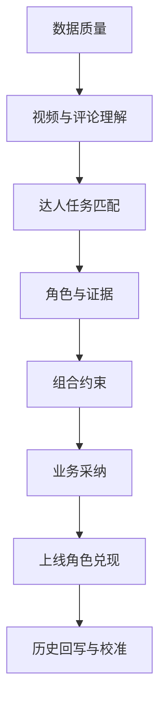
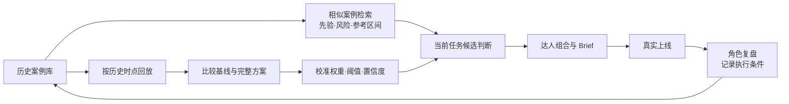

本分册用于回答两类问题：系统是否把正确的达人和证据放到了前面；这些判断进入真实投放后，是否减少了业务成本并提高了组合质量。评价不以单一准确率代替业务结果，也不以一次销售波动证明因果。

# 1. 评价框架

系统采用“分层门禁”验收。数据不可用时不评模型；证据不可追溯时不允许进入组合；组合违反市场、预算或合规硬约束时，即使离线分数较高也视为不合格。

# 2. 测试集与人工标注

## 2.1 评价单元

| 层级 | 最小评价单元 | 典型问题 |
|-|-|-|
| 视频 | 视频及必要的时间片 | 是否属于目标场景；产品如何进入内容；是否有可模仿动作 |
| 评论 | 单条评论及上下文 | 是否包含购买意向、功能问题、顾虑或价格/渠道询问 |
| 达人×任务 | 某达人在某一具体 Brief 下的判断 | 是否适配、适合什么角色、证据是否充分 |
| 组合×任务 | 一组达人及角色、预算配置 | 是否覆盖核心场景、角色互补、预算和风险是否可接受 |
| 投放结果 | 达人内容或整项 Campaign | 是否兑现预设角色；可归因程度到哪一层 |

## 2.2 黄金集构建

从不同产品、市场、场景、达人量级和结果区间中分层抽样。视频和评论由两名标注员独立判断，分歧交由第三人裁决；达人角色和组合质量由至少一名业务人员与一名内容策略人员共同确认。历史合作数据按投放前时间切点冻结，保证测试输入不包含未来信息。

建议首期黄金集至少包含 300 条视频、2,000 条评论、100 个“达人×任务”样本和 20 个完整投放任务。该数量用于建立首版基线，不代表统计功效已经充分；真实样本不足时，应同时报告样本量和置信区间，不能只给一个百分比。

## 2.3 一致性要求

| 标注任务 | 一致性指标 | 初始门槛 | 未达标处理 |
|-|-|-|-|
| 二分类/多分类标签 | Cohen's Kappa 或 Fleiss' Kappa | ≥0.70 | 重写定义，补充边界样例后重标 |
| 1–5 级评分 | 加权 Kappa / ICC | ≥0.70 | 合并难区分等级或增加锚点样例 |
| 时间片标注 | 时间区间 IoU | ≥0.60 | 明确动作起止规则 |

# 3. 数据质量指标

| 指标 | 定义/计算 | 初始目标 | 备注 |
|-|-|-|-|
| 必填字段完整率 | 非空必填字段数÷应有必填字段数 | ≥95% | Task 硬约束字段必须 100% |
| 来源可追溯率 | 含 source、source_id、snapshot_at 的记录÷全部记录 | 100% | 无来源记录不得用于关键结论 |
| 实体去重准确率 | 正确合并/拆分的账号对÷抽检账号对 | ≥98% | 跨平台同人只做关联，不覆盖平台原始 ID |
| 时效达标率 | 在规定更新窗口内的数据÷全部需更新数据 | ≥90% | 报价、档期与受众数据分别配置窗口 |
| 时间泄漏率 | 回放输入中晚于决策切点的字段÷全部输入字段 | 0% | 发现一处即该批回放无效 |
| 异常值处理覆盖率 | 已标记或处理异常÷抽检异常 | ≥95% | 包括互动突增、评论异常、货币单位错误 |

# 4. 候选召回与硬筛指标

**候选召回率。**黄金集中符合硬约束且被专家认为“应进入评估”的达人，被系统召回的比例。公式为 Recall = TP/(TP+FN)。首期目标 Recall@CandidatePool ≥90%，原因是后续再好的排序也无法补回未进入池子的达人。

**硬筛准确率。**分别报告 Precision、Recall 和混淆矩阵。市场、语言、品牌安全等明确规则的 Recall 目标不低于 98%；信息缺失应进入“待确认”，不得默认视为通过或排除。

**深评压缩率。**进入视频/评论深评人数÷原始候选人数，目标≤5%。该指标必须与深评阶段的召回率一起看：如果压缩率低但漏掉高质量达人，不能视为效率提升。

**排除解释完整率。**包含规则、字段值、快照时间和可撤销原因的排除记录÷全部排除记录，目标 100%。

# 5. 视频与场景理解指标

## 5.1 场景识别

| 指标 | 用途 | 首期目标 |
|-|-|-|
| 场景 Macro-F1 | 平衡骑行、滑雪、潜水、旅行等类别表现 | ≥0.80 |
| 核心场景 Recall | 减少漏掉任务核心场景内容 | ≥0.90 |
| 细分场景准确率 | 如公路骑行/山地骑行、第一视角/第三视角 | ≥0.75 |
| 时间片 IoU | 判断场景或产品展示的起止位置 | ≥0.60 |

## 5.2 内容价值评分

内容价值采用 1–5 级人工锚点评分，用于训练/校准和人工复核，不把主观印象包装成绝对事实。

| 维度 | 1 分锚点 | 3 分锚点 | 5 分锚点 |
|-|-|-|-|
| 产品承载自然度 | 生硬露出，与情节无关 | 产品参与部分关键动作 | 产品能力直接解决场景问题并推动叙事 |
| 内容可模仿性 | 依赖极端资源或明星身份 | 部分动作可被一般用户复刻 | 动作、镜头或玩法简单清楚，易形成用户模仿 |
| 前三秒钩子 | 信息不明或进入主题慢 | 主题清楚但刺激不足 | 冲突/结果/动作立即出现且与产品场景相关 |
| 场景真实感 | 摆拍痕迹强，使用逻辑不可信 | 基本符合使用情境 | 细节完整，能让目标用户代入真实使用过程 |
| 信息解释力 | 只展示，不解释价值 | 说明一个主要卖点 | 将功能、使用结果和用户问题清楚连接 |

模型与人工评分比较使用 MAE、Spearman 秩相关和等级混淆矩阵。首期目标：各维度 MAE≤0.8，Spearman ρ≥0.60；比“均给 3 分”的常数基线和只用互动率的基线显著更好。

# 6. 评论语义与购买意向指标

| 标签 | 定义 | 主要指标 | 首期目标 |
|-|-|-|-|
| 明确购买意向 | 计划购买、已下单、询问购买入口 | Precision / Recall / F1 | P≥0.85，R≥0.75 |
| 价格与渠道询问 | 价格、优惠、库存、地区购买方式 | Macro-F1 | ≥0.80 |
| 功能问题 | 续航、防水、画质、安装、兼容等 | Macro-F1 | ≥0.80 |
| 使用顾虑 | 可靠性、学习成本、体积、售后等阻力 | Recall | ≥0.80 |
| 场景共鸣 | 表达“我也需要/我也遇到”但未明确购买 | F1 | ≥0.75 |
| 无关互动/表情 | 不提供产品或场景信息 | 准确率 | ≥0.90 |

评论意向率 = 符合目标意向标签的有效评论数÷有效抽样评论数。报告必须同时给出样本量和抽样方式；少于 30 条有效评论时只展示描述性结果，不用于强结论。

# 7. 达人—任务匹配与排序指标

**Precision@K。**前 K 名中被专家判为“适合进入商务评估”的达人占比，反映 BD 首屏效率。

**Recall@K。**全部适合达人的多少被放进前 K，防止系统只推荐少数显眼达人。

**NDCG@K。**使用 0–3 级相关性标签评价排序，越相关且位置越靠前贡献越高，适合具有多个相关等级的达人匹配任务。

**Spearman ρ。**比较系统排序与专家/真实结果排序的一致程度，主要用于历史回放。

| 基线 | 排序逻辑 | 比较目的 |
|-|-|-|
| B0 粉丝量 | 按粉丝数降序 | 验证是否超越行业最粗糙规则 |
| B1 互动率 | 按近期互动率降序 | 检验内容/受众/评论信号的增量价值 |
| B2 市场与受众匹配 | 硬筛后按受众重合排序 | 检验场景与多模态理解的增量价值 |
| B3 人工历史名单 | 现有 BD 经验形成的 shortlist | 比较系统对实际工作的补充程度 |
| 完整方案 | 硬约束＋场景内容＋评论意向＋历史校准 | 目标方案 |

首期验收：完整方案的 NDCG@10 或 Precision@10 相对最佳可用基线提升≥20%。若样本不足以支持显著性判断，至少报告逐任务差值、bootstrap 95% 置信区间和失败案例。

# 8. 角色判断与可解释性指标

角色可多标签，但必须指定主角色。评价引爆、扩散、转化、潜力探索四类的 Macro-F1、每类 Recall 和混淆矩阵；首期 Macro-F1 目标≥0.70。高风险角色错误单独统计，例如把仅有泛流量的达人误判为转化型。

| 指标 | 定义 | 目标 |
|-|-|-|
| 关键结论证据可追溯率 | 可回到原始视频/评论/字段和时间的关键结论÷全部关键结论 | 100% |
| 证据相关性 | 人工判断证据能直接支持对应结论的比例 | ≥90% |
| 无依据陈述率 | 找不到来源或超出证据含义的陈述÷全部抽检陈述 | ≤2% |
| 反证覆盖率 | 高置信推荐中已记录主要反证/风险的比例 | ≥90% |
| 人工推翻率 | 复核后被完全推翻的高置信结论÷高置信结论 | ≤10% |
| 证据过期提示率 | 超过时效窗口后被正确降级的证据÷应降级证据 | 100% |

# 9. 达人组合指标

| 指标 | 计算口径 | 初始目标 |
|-|-|-|
| 核心场景覆盖率 | 至少有一名合格达人承接的核心场景权重÷全部核心场景权重 | ≥90% |
| 角色覆盖率 | 任务要求角色中已配置合格达人的角色数÷要求角色数 | 100% |
| 预算偏差率 | \|组合预算−任务预算\|÷任务预算 | ≤5% |
| 预算集中度 | 单一达人预算÷组合总预算；同时报告 HHI | 非专项引爆任务单人≤35% |
| 替补可用率 | 有同角色、同核心场景替补的关键达人÷关键达人 | ≥80% |
| 一人退出覆盖损失 | 任一达人退出后的最大场景覆盖下降 | ≤20 个百分点 |
| 报价不确定性暴露 | 使用过期/区间过宽报价的预算占比 | ≤20% |
| 探索预算占比 | 潜力探索角色预算÷总预算 | 10%–20%（由任务风险偏好调整） |

组合质量还应与“简单取前 K 名”做消融比较。若系统评分很高但组合在场景、角色或预算上高度同质，不能通过组合验收。

# 10. 产品效率与业务采纳指标

| 指标 | 口径 | 初始目标 |
|-|-|-|
| 任务与证据整理时长 | 从 Brief 确认到可评审 shortlist/组合所需人时 | 较现状下降≥50% |
| 业务采纳率 | 被业务正式采用的系统组合数÷提交评审组合数 | ≥60% |
| 候选新增价值 | 最终采用且不在人工初始名单中的达人占比 | 先测基线，建议≥20% |
| 组合大改率 | 发布前发生角色/达人/预算结构性重做的组合占比 | ≤30% |
| 证据点击率 | 评审过程中被查看的证据卡÷进入评审的证据卡 | 用于判断解释是否真正被使用 |
| 人工复核时长 | 每位深评达人平均复核分钟数 | 先测基线，目标下降≥30% |

采纳率需要结合候选新增价值、改动原因和真实节省时长解释。系统若只是复现人工名单，即使采纳率高，也没有带来新的覆盖与判断价值。

# 11. 上线后角色兑现与归因

| 角色 | 主指标 | 辅指标 | 兑现判断示例 |
|-|-|-|-|
| 引爆 | 内容播放/互动相对达人自身基线的提升；品牌词/话题外溢 | 二创、模仿、跨账号传播 | 达到预设峰值且出现目标话题外溢 |
| 扩散 | 增量触达、目标市场/细分场景覆盖 | 有效观看、受众重合、CPM | 覆盖预定场景与人群，单位触达在阈值内 |
| 转化 | 点击、加购、订单、优惠码/联盟链接收入 | 购买意向评论、功能问答、CVR | 直接追踪链路达到目标，或高质量意向显著高于基线 |
| 潜力探索 | 单位成本结果、内容成长、后续报价变化 | 粉丝/互动增速、重复合作意愿 | 用小预算获得超过探索阈值的信号，进入观察池 |

**角色兑现率。**达到该角色预先定义门槛的达人数量÷该角色实际上线达人数量，首期目标≥70%。门槛必须在上线前锁定，不能在看到结果后修改。

**归因层级。**一级为直接追踪：专属链接、优惠码、平台归因；二级为相关变化：品牌词、讨论、自然流量与销售同向变化；三级为增量：随机对照、地理/时间对照或可靠的准实验。报告中必须显示层级，二级结果不得写成“由达人投放带来”。

# 12. 系统与成本指标

| 指标 | 初始目标 | 说明 |
|-|-|-|
| 普通页面 P95 响应时间 | ≤3 秒 | 不含异步多模态任务 |
| 深评任务成功率 | ≥95% | 平台内容不可用需单列，不算模型成功 |
| 单候选深评成本 | 完成基线后设上限 | 包括模型、转写、翻译、第三方数据 |
| 任务成本超限率 | ≤5% | 超过预算门控需人工批准 |
| 审计日志完整率 | 100% | 涉及推荐、排除、人工改动和版本发布 |

# 13. 验收门禁与判定

| 门禁 | 通过条件 | 失败后动作 |
|-|-|-|
| G1 数据 | 来源可追溯 100%，时间泄漏 0%，硬约束字段完整 | 停止算法评价，先修数据 |
| G2 内容理解 | 核心场景 Recall≥0.90；评论意向 Precision≥0.85 | 扩大标注与错误分析 |
| G3 排序 | NDCG@10 或 Precision@10 较最佳基线提升≥20% | 做特征消融，定位无效信号 |
| G4 解释 | 关键证据可追溯 100%，无依据陈述≤2% | 禁止进入组合发布 |
| G5 组合 | 场景≥90%、角色完整、预算偏差≤5%、集中度达标 | 重算组合或要求书面豁免 |
| G6 业务试用 | 整理时长下降≥50%，采纳率≥60% | 分析业务改动原因并迭代页面/规则 |
| G7 复盘 | 角色兑现率≥70%，执行条件和归因层级完整 | 不进入自动校准，转人工审查 |

# 14. 基线校准与人工复核

上述目标是开题阶段的初始验收值，其中核心场景覆盖≥90%、单人预算占比≤35%、业务采纳率≥60%、角色兑现率≥70%具有明确管理意义，可以先写入方案；但最终阈值应在历史基线测算后锁定版本。团队需人工复核以下内容：历史任务数量与分层是否足够；现行业务平均耗时；不同市场/产品的预算集中度；角色兑现门槛；销售、搜索和内容数据的可用周期。

每次指标调整必须保留旧值、样本区间、调整原因和审批人。若指标为了迁就某次结果而事后修改，该次结果不得用于证明方案有效。

---

历史数据直接进入“选人—投放—复盘—校准”的主链。它先服务当前任务，帮助系统找到相似案例、识别风险和形成合理先验；随后作为离线回放材料，检查当时的判断能否解释后来的结果；验证结论再用于调整权重、阈值和置信度。

# 1. 验证目标与边界

本协议检验三件事：在不使用未来信息的前提下，系统能否把后来更符合任务目标的合作达人排在前面；角色判断是否与上线后的实际表现一致；组合方法是否比简单取前 K 名更好地覆盖场景、角色并控制预算风险。

历史回放属于观察性离线验证，可以证明系统在既有样本中的排序和解释能力，不能单独证明因果增量。销售增长、搜索变化或内容爆发可能同时受到折扣、新品、大促、媒体投放、断货和执行质量影响。因果结论需要后续小规模前瞻试验或可靠准实验。

# 2. 历史数据在业务主链中的位置

同一条历史记录在使用时有严格身份：用于当前决策时，只能作为相似案例和风险参照；用于回放时，输入与结果必须按时间切开；用于校准时，只使用已经完成质量复核的回放结果。

# 3. 研究问题与假设

| 编号 | 研究问题/假设 | 主要检验 |
|-|-|-|
| H1 | 场景、内容结构和评论意向加入后，达人排序优于粉丝量、互动率和受众匹配基线。 | NDCG@K、Precision@K、逐任务差值 |
| H2 | 基于任务定义的角色判断与上线后的角色兑现具有中等以上一致性。 | Macro-F1、每类 Recall、混淆矩阵 |
| H3 | 组合优化比直接取排序前 K 名具有更高场景/角色覆盖和更低预算集中风险。 | 场景覆盖、角色覆盖、HHI、单人预算占比 |
| H4 | 加入影石历史相似案例后，完整方案比只用公开数据更稳定。 | 消融实验、bootstrap 区间、任务分层 |
| H5 | 证据卡能减少业务复核时间，并降低高置信结论被完全推翻的比例。 | 复核耗时、推翻率、证据相关性 |

# 4. 样本框架

## 4.1 分析单位

核心单位为“达人×投放任务”。同一个达人面对北美骑行新品和欧洲潜水套装，匹配结论可以不同。组合评价单位为“任务×组合版本”；内容评价单位为实际上线的单条内容。

## 4.2 纳入与排除

| 规则 | 定义 | 原因 |
|-|-|-|
| 纳入 | 能确认任务目标、市场、产品、合作达人、实际成本、上线时间与至少一类结果 | 确保能还原输入与标签 |
| 纳入 | 能取得决策前的账号/内容快照，或有可信的历史存档 | 防止时间泄漏 |
| 排除 | 达人内容未正常上线、严重偏离 Brief 且无法单独解释 | 选人判断与执行失败无法区分 |
| 排除/单列 | 断货、重大舆情、全站大促、超大规模媒体投放等极端事件 | 作为特殊层分析，不与常规任务混合 |
| 不标负样本 | 未合作或未被联系的候选达人 | 没有真实结果，只能记为未标注 |

## 4.3 分层变量

至少按产品线、目标市场、场景、主目标、预算级别、平台、达人量级和投放时期分层。若某层样本少于 5 个任务，只做描述性结果，不宣称该层已验证。

## 4.4 样本规模建议

首轮建议纳入不少于 20 个完整任务、100 个已合作“达人×任务”样本。若实际可用样本更少，协议不因此失效，但结论应降级为可行性回放：逐案例展示、报告置信区间，不用“显著提升”作强结论。团队需在提交前人工核对可用任务数和各层分布。

# 5. 时间切点与泄漏控制

每个任务建立 decision_cutoff_at，通常取最终达人名单锁定或首次发出正式报价前的时间。系统输入只允许读取该时点前已存在的数据，投放后出现的粉丝增长、爆款内容、评论和受众变化只能进入结果区。

| 字段 | 输入允许 | 结果区 |
|-|-|-|
| 决策前粉丝/互动/内容 | 允许，必须有快照时间 | 可作为基线 |
| 决策后发布内容表现 | 禁止 | 结果 |
| 最终实际报价 | 若决策前已知则允许；否则只用当时区间 | 实际成本 |
| 是否被最终选中 | 不得作为特征 | 样本状态 |
| 投放后品牌词/销售 | 禁止 | 结果或相关变化 |
| 人工复盘结论 | 禁止 | 黄金标签 |

每批回放先执行自动泄漏扫描，再由数据人员抽检。发现任何未来字段进入输入时，该批结果作废并重新生成。

# 6. 结果标签与角色兑现

标签在运行系统前锁定。不同角色使用不同结果函数，避免用销售额统一评价引爆与扩散。

| 角色 | 主要结果 | 标签建议 | 需记录的混杂因素 |
|-|-|-|-|
| 引爆 | 相对个人基线的播放/分享峰值；品牌词/话题外溢 | 0 未兑现；1 部分；2 兑现；3 超预期 | 媒体加热、热点、发布时间、二次转载 |
| 扩散 | 目标市场/场景触达、有效观看、单位触达成本 | 0–3 级 | 平台分发、频次、受众重合 |
| 转化 | 链接/优惠码点击、加购、订单、收入或高质量意向 | 0–3 级 | 折扣、库存、落地页、价格、促销 |
| 潜力探索 | 单位成本结果、内容成长、后续合作价值 | 0–3 级 | 低预算、制作支持、账号自然增长 |

结果数据不足时允许“无法判断”，不得强行映射为 0。角色兑现标签由业务与数据人员共同复核，分歧保留原始判断并记录裁决。

# 7. 对照基线与消融方案

| 方案 | 使用信号 | 回答的问题 |
|-|-|-|
| B0 粉丝量 | 粉丝数 | 是否超过最简单的头部优先 |
| B1 互动率 | 近期互动率 | 是否超过“现在热”的表现信号 |
| B2 受众匹配 | 市场、语言、受众重合 | 内容场景是否提供额外价值 |
| B3 业务原始 shortlist | 当时人工名单 | 是否补充人工覆盖和判断 |
| A1 无评论 | 完整方案去掉评论意向 | 评论语义的增量价值 |
| A2 无视频深评 | 只用结构化账号数据 | 多模态视频理解的增量价值 |
| A3 无历史 | 去掉相似案例与校准 | 影石私有历史数据的增量价值 |
| Full | 硬约束＋场景＋内容＋评论＋历史校准 | 目标方案 |

# 8. 回放流程

1. 冻结协议、标签定义、基线、K 值、角色门槛和排除规则。
2. 按任务整理 decision_cutoff_at 前的可用数据，生成不可修改的 replay_snapshot_id。
3. 数据质量检查：必填、来源、异常、去重和时间泄漏。
4. 对每个任务分别运行 B0–B3、A1–A3 和 Full，保存完整候选排序、角色与证据。
5. 在不查看结果的情况下，由业务人员复核证据是否合理，记录处理时间和推翻原因。
6. 打开结果标签，计算排序、角色、组合和解释性指标。
7. 按市场、产品、场景、平台和样本时期分层，检查平均值是否掩盖局部失败。
8. 进行敏感性分析和失败案例复盘，形成校准建议。
9. 校准建议经审批后发布新版本；旧回放结果不重写，新版本另跑。

# 9. 分析指标与统计方法

**排序。**主要指标 NDCG@10 与 Precision@10；辅助指标 Recall@10、Spearman ρ。每个任务先计算，再对任务取均值，避免大型任务支配结果。

**角色。**Macro-F1、各角色 Recall、混淆矩阵和角色兑现率。多标签场景同时报告主角色准确率与多标签 F1。

**组合。**核心场景覆盖、角色覆盖、预算偏差、单人预算占比、HHI、替补可用率和一人退出后的最大覆盖损失。

**不确定性。**对逐任务差值做 bootstrap，给出 95% 置信区间；样本很小时报告所有任务的散点/区间和中位数，不依赖正态假设。多个指标同时检验时，明确主要指标并谨慎解释次要指标。

**通过标准。**Full 的 NDCG@10 或 Precision@10 相对最佳可用基线提升≥20%，且大多数任务方向一致；角色 Macro-F1≥0.70；组合核心场景覆盖≥90%，非专项任务单人预算占比≤35%；关键结论证据可追溯率 100%。

# 10. 混杂因素与阻断策略

| 混杂因素 | 记录字段 | 分析处理 |
|-|-|-|
| 大促/折扣 | discount_rate、promotion_type、period | 分层或作为协变量；不可缺失时混为自然效果 |
| 新品发布/媒体投放 | launch_event、paid_media_spend | 极端案例单列；相关变化不作因果 |
| 内容执行质量 | brief_deviation、production_quality、approval_rounds | 区分选人错误与执行错误 |
| 库存/落地页 | stockout_hours、page_error、shipping_limit | 转化角色评价时调整或排除 |
| 平台分发变化 | platform、content_format、period | 按平台和时期阻断 |
| 达人重复合作 | prior_collab_count、days_since_last | 检验新老达人差异 |

# 11. 敏感性与稳健性检查

- 改变 K（5、10、20）检查排序优势是否只在某个截断点存在。
- 改变结果窗口（7、14、30 天）检查角色兑现是否依赖窗口。
- 排除极端高预算和头部达人，检查结论是否由少数样本推动。
- 分别使用报价下界、中心和上界重算组合，检查预算配置稳健性。
- 对缺失受众、缺失评论等数据降级样本单独报告。
- 人工名单与系统名单交集/差集分别分析，验证新增候选是否真正有价值。

# 12. 前瞻试用设计

离线回放通过后，建议选择若干相似的北美场景任务开展前瞻试用。条件允许时，将任务按产品、预算和场景配对，一组采用系统辅助，一组沿用现有流程；至少比较候选整理时间、组合采纳率、场景覆盖和上线后角色兑现。若无法随机分配，应记录任务难度和业务团队差异，避免把团队能力差异当作系统效果。

系统只向业务人员展示决策时可用信息；上线前锁定角色和验收门槛；结果分析者尽量在不知道方案来源的情况下完成标签复核。前瞻试用仍以验证可用性和方向为主，不在小样本阶段承诺确定的销售增量。

# 13. 校准发布与停止条件

只有通过数据质量门禁、证据抽检和主要指标评审的回放结果才可进入校准。每次校准记录样本范围、旧值、新值、改动原因、离线收益、受影响任务和审批人。

| 情况 | 决策 |
|-|-|
| 排序提升但证据无依据率超标 | 不发布；先修证据链 |
| 总体提升但某核心市场显著下降 | 分市场阈值或保留人工门禁，不做全局发布 |
| 提升来自单一头部案例 | 不认定通过；扩大样本 |
| 角色兑现低且执行严重偏离 Brief | 不直接归因于选人；先做执行分层 |
| 连续两个版本未优于简单基线 | 暂停增加复杂特征，回到标签与数据质量检查 |

# 14. 回放报告模板

每次回放报告至少包含：样本流程图与排除数量；各层样本分布；数据完整与泄漏检查；各基线和完整方案的逐任务结果；角色混淆矩阵；组合覆盖和集中度；证据抽检；失败案例；混杂因素；敏感性分析；校准建议；人工复核结论。

# 15. 提交前人工复核项

- [ ] 确认“汇款验证协议”为“历史回放验证协议”的文字更正。

- [ ] 确认实际可用的历史任务数、合作达人样本数和未合作候选的保存情况。

- [ ] 确认每类角色可取得的真实结果字段和时间窗口。

- [ ] 确认 decision_cutoff_at 的业务定义，以及是否存在可用的历史快照。

- [ ] 确认大促、折扣、库存、媒体投放和内容审核记录能否补齐。

- [ ] 由业务、数据和内容三方锁定标签规则与主要指标，完成后再运行回放。