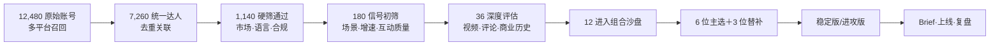

# 1. 演示目标

演示沿一项真实任务展开：系统先锁定北美市场和城市骑行场景，从大候选池中逐级筛选；对少量候选做视频和评论深评；给每位候选分配角色并生成可复核证据；最终形成稳定版、进攻版与关键替补；上线后按角色复盘，结果回写历史库。模型分数只作为过程信息。

# 2. 示例任务 Brief

| 字段 | 演示值 | 对判断的影响 |
|-|-|-|
| 产品 | Insta360 运动相机新品（演示 SKU） | 强调防抖、免手持视角、快速剪辑 |
| 市场 | 美国、加拿大英语区 | 非目标市场受众不进入自动推荐 |
| 核心场景 | 城市通勤骑行、周末公路骑行 | 山地极限内容可做补充，不能替代核心场景 |
| 目标 | 建立“骑行随手拍”内容样板，同时承接购买意向 | 组合需同时有引爆、扩散和转化角色 |
| 平台 | YouTube、TikTok、Instagram Reels | 长测评与短视频协同 |
| 预算 | USD 100,000（演示值） | 非专项任务单一达人预算占比≤35% |
| 上线窗口 | 4 周 | 档期未知的达人进入待确认或替补 |
| 硬约束 | 英语内容；北美受众为主；品牌安全通过；商业披露清楚 | 先硬筛，再排序 |

# 3. 全流程漏斗

候选数用于解释“越往下越贵、样本越少”的工程逻辑。系统不对 7,260 位达人逐条做昂贵的视频理解；只有通过硬筛和低成本信号筛选的 36 位进入深评，预计深评占原始池 0.29%。

# 4. Step 1：候选召回与身份去重

系统从第三方候选库、平台搜索、场景关键词、相似达人和影石历史合作池召回账号。跨平台账号通过公开链接、简介、内容交叉引用等关联为统一 creator_id，但平台原始 ID 保留。

| 候选原型 | 平台 | 初始信号 | 系统处理 |
|-|-|-|-|
| A｜都市骑行叙事型 | TikTok＋Instagram | 城市通勤、第一视角、增长快 | 两个账号合并为同一达人 |
| B｜器材深度测评型 | YouTube | 搜索长尾强、功能问答多 | 保留独立账号 |
| C｜极限山地头部 | YouTube＋Instagram | 粉丝高、画面震撼 | 标记核心场景重合不足 |
| D｜南美旅行骑行 | TikTok | 内容好、互动高 | 北美受众不足，硬筛排除 |
| E｜北美家庭周末骑行 | Instagram | 场景真实、规模中等 | 进入扩散候选 |
| F｜新锐 POV 剪辑型 | TikTok | 粉丝少、近 8 周增长快 | 进入潜力探索候选 |

# 5. Step 2：硬约束筛选

北美市场属于准入条件。系统依次检查主要受众市场、内容语言、品牌安全、可合作状态、上线窗口和平台要求。候选 D 的内容质量虽高，但主要受众在南美，不进入该任务；如未来创建南美任务，可重新参与评估。

| 状态 | 演示数量 | 示例原因 |
|-|-|-|
| 通过 | 1,140 | 目标市场/语言匹配，未发现硬性品牌风险 |
| 排除 | 5,420 | 非目标市场、长期停更、语言不符、明确竞品冲突 |
| 待确认 | 700 | 受众地域、档期或授权信息不足 |

“待确认”是重要状态：信息不足与不合格分开，避免系统把缺数据的潜力达人误杀。

# 6. Step 3：低成本信号初筛

系统使用账号与内容元数据计算四组信号：场景相关性、内容势能、互动质量和商务可行性。该阶段只决定谁值得花成本深评，不直接给出最终推荐。

| 信号 | 演示规则 | 进入深评的典型理由 |
|-|-|-|
| 场景相关 | 近 90 天目标场景内容占比和表现 | A 的通勤骑行占 46%，且近期连续更新 |
| 增长势能 | 同账号近 8 周相对前 24 周趋势 | F 规模小但中位播放和分享持续上升 |
| 互动质量 | 有效问题、分享、收藏相对泛互动 | B 评论中功能问题密度高 |
| 商务可行 | 报价区间、档期、合作历史和授权 | E 报价稳定、档期可确认 |

# 7. Step 4：视频与评论深评

对 36 位候选各选择 6–12 条代表内容，覆盖近期高表现、典型场景和商业合作。系统标注场景、视角、叙事、产品承载、可模仿性与披露，并对评论做分层抽样。内容策略人员复核高置信结论和所有进入组合的达人。

## 7.1 候选 A 的深评摘要

| 维度 | 演示结论 | 证据 | 风险 |
|-|-|-|-|
| 场景匹配 | 高：通勤和城市路况稳定出现 | 近 90 天 24 条视频中 11 条为城市骑行 | 周末公路骑行内容较少 |
| 内容可模仿 | 高：固定机位切换＋路线前后对比 | 3 条代表视频出现用户模仿评论 | 需要确认安装方式可被普通用户复刻 |
| 产品承载 | 中高：镜头与路线叙事天然需要运动相机 | 第一视角、后视角和骑行者自拍切换 | 历史商业内容口播较少 |
| 购买意向 | 中：设备询问多，明确购买较少 | 200 条有效评论中 31 条设备/安装询问，12 条明确购买意向 | 评论样本来自 4 条高表现视频 |
| 适合角色 | 主角色：引爆；次角色：扩散 | 内容动作鲜明，场景真实，具备样板价值 | 转化承接需与测评型达人配合 |

## 7.2 证据卡完整样例

| **证据卡 ID** | EVD-DEMO-A-017 |
|-|-|
| **任务** | 北美城市通勤骑行新品 |
| **达人/角色** | 候选 A；主角色“引爆” |
| **结论** | 该达人适合制作“一个人完成多视角通勤记录”的内容样板，强项是动作设计与场景代入，不宜单独承担完整转化。 |
| **支持证据 1** | 视频 A-07，00:02–00:08 在红绿灯前完成前视角/后视角切换；该结构在同账号三条骑行视频重复出现。 |
| **支持证据 2** | 视频 A-11 评论抽样 50 条，其中 9 条询问安装位置或设备，3 条表达准备购买同类设备。 |
| **支持证据 3** | 该类视频近 90 天中位分享率为账号其他内容的 1.7 倍（演示值）。 |
| **反证/风险** | 历史付费合作中缺少长口播与购买链路；核心受众中加拿大占比待第三方数据复核。 |
| **数据切点** | 2026-06-30 23:59 UTC（演示） |
| **置信度** | 0.82；视频证据高，转化判断中等 |
| **来源与复核** | 公开视频/评论＋模型 V0.3；内容策略人工确认 |

证据卡将“为什么选”与“哪里可能错”同时放在页面上。评委点击结论即可回到对应视频时间片和评论原文；原始内容失效时，证据状态自动降级。

# 8. Step 5：角色判断与候选沙盘

| 候选 | 主角色 | 场景 | 报价区间（演示） | 关键判断 |
|-|-|-|-|-|
| A 都市骑行叙事型 | 引爆 | 城市通勤 | \$28k–\$34k | 动作样板强，转化承接一般 |
| B 器材深度测评型 | 转化 | 通勤＋装备评测 | \$16k–\$20k | 搜索长尾和功能问题承接强 |
| C 极限山地头部 | 引爆候选 | 山地极限 | \$38k–\$50k | 势能高，但核心场景与预算风险较大 |
| E 家庭周末骑行 | 扩散 | 家庭/周末公路 | \$10k–\$14k | 真实感强，覆盖新增人群 |
| F 新锐 POV 剪辑型 | 潜力探索 | 城市＋夜骑 | \$4k–\$7k | 增长快、报价低，但稳定性待验证 |
| G 公路训练教练型 | 转化/扩散 | 周末公路 | \$12k–\$16k | 专业解释强，内容娱乐性中等 |
| H 城市生活方式型 | 扩散 | 城市通勤 | \$8k–\$12k | 人群重合好，骑行内容占比中等 |
| I 科技短测型 | 转化 | 设备对比 | \$9k–\$13k | CTA 强，但场景代入较弱 |

# 9. Step 6：稳定版与进攻版组合

## 9.1 稳定版

| 达人 | 角色 | 预算 | 承担任务 |
|-|-|-|-|
| A | 引爆 | \$30k | 通勤多视角内容样板 |
| B | 转化 | \$18k | 长测评与搜索问题承接 |
| E | 扩散 | \$12k | 家庭/周末场景 |
| G | 转化＋扩散 | \$14k | 公路训练和专业解释 |
| H | 扩散 | \$10k | 城市生活方式人群 |
| F | 潜力探索 | \$6k | 夜骑 POV 新玩法 |
| 制作与应急余量 | — | \$10k | 补拍、剪辑、替补差价 |

稳定版总预算 \$100k，单人最高占比 30%；城市通勤、周末公路、家庭和夜骑均有承接；引爆、扩散、转化、探索四类角色完整。

## 9.2 进攻版

| 达人 | 角色 | 预算 | 变化 |
|-|-|-|-|
| C | 引爆 | \$35k | 引入更高势能的山地头部，但只用报价下界 |
| A | 引爆/扩散 | \$25k | 保留核心城市内容样板 |
| B | 转化 | \$17k | 维持长测评承接 |
| E | 扩散 | \$10k | 压缩家庭场景预算 |
| F | 潜力探索 | \$6k | 保留新锐实验 |
| 应急余量 | — | \$7k | 较稳定版更少 |

进攻版上行空间更高，但山地极限内容可能稀释“日常骑行随手拍”的核心认知，且报价上浮后容易超预算。系统因此同时展示收益假设、失效条件和替补，不把它简单标成“更高分”。

# 10. Step 7：替补与 What-if 演算

**情境：**候选 A 临时无档期。用户在组合页选择“替换为 H＋I”。系统立即重算：

| 指标 | 替换前 | 替换后 | 系统提示 |
|-|-|-|-|
| 总预算 | \$100k | \$101k | 超出 1%，可从应急余量调整 |
| 城市通勤覆盖 | 完整 | 完整 | H 承接生活方式场景 |
| 引爆角色强度 | 高 | 中 | 缺少强动作样板，建议加强 F 的创意资源 |
| 转化承接 | 中高 | 高 | I 增加短测评与 CTA |
| 单人预算集中度 | 30% | 18% | 风险下降 |

这一步展示组合的价值：每次达人替换都要重新检查角色、场景、预算和风险，榜单中的下一名未必能补上原有缺口。

# 11. Step 8：本地化 Brief 样例

**对象：**候选 A｜引爆角色｜城市通勤。

**内容任务。**用一次真实早高峰通勤展示“一个人也能完成前、后、自拍多视角记录”。前 3 秒先给出险些错过路口或车流变化的结果画面，再回到拍摄过程。

**必须出现。**安装过程的一个清晰镜头；骑行中至少两种视角；稳定画面对比；从拍摄到成片的简短操作；通勤结束后的真实使用评价。

**表达边界。**不使用未经证实的绝对性能表述；不弱化安全骑行；商业合作关系在视频与描述中清晰披露；具体措辞由北美法务/平台规则复核。

**CTA。**鼓励观众分享最想记录的通勤瞬间；若使用购买链接，须与转化追踪配置一致。

**验收。**内容保持达人原有节奏；核心动作在前 8 秒出现；产品参与多视角叙事，承担清晰的场景功能。

# 12. Step 9：上线监测与角色复盘

演示在发布后第 14 天打开复盘页。系统展示的结果同样为演示数据。

| 达人 | 预设角色 | 演示结果 | 兑现判断 | 回写内容 |
|-|-|-|-|-|
| A | 引爆 | 播放为个人同类中位数 2.4 倍，出现 18 条模仿/拍法询问 | 兑现 | “多视角通勤动作”进入可复用模式库 |
| B | 转化 | 链接点击和功能问题高，订单在目标区间 | 兑现 | 功能解释与搜索长尾信号权重上调候选 |
| E | 扩散 | 触达目标人群，但播放低于个人基线 | 部分兑现 | 场景合适，发布时间和开头节奏需优化 |
| F | 潜力探索 | 单位成本分享高，绝对量仍小 | 兑现探索目标 | 进入下一季观察池，不直接升级为头部 |

页面同时显示大促、折扣、库存和其他媒体投放。若品牌词与销量同向上升但没有对照，系统标记为“相关变化”；只有专属链接/优惠码结果属于直接追踪，因果增量留待后续实验。